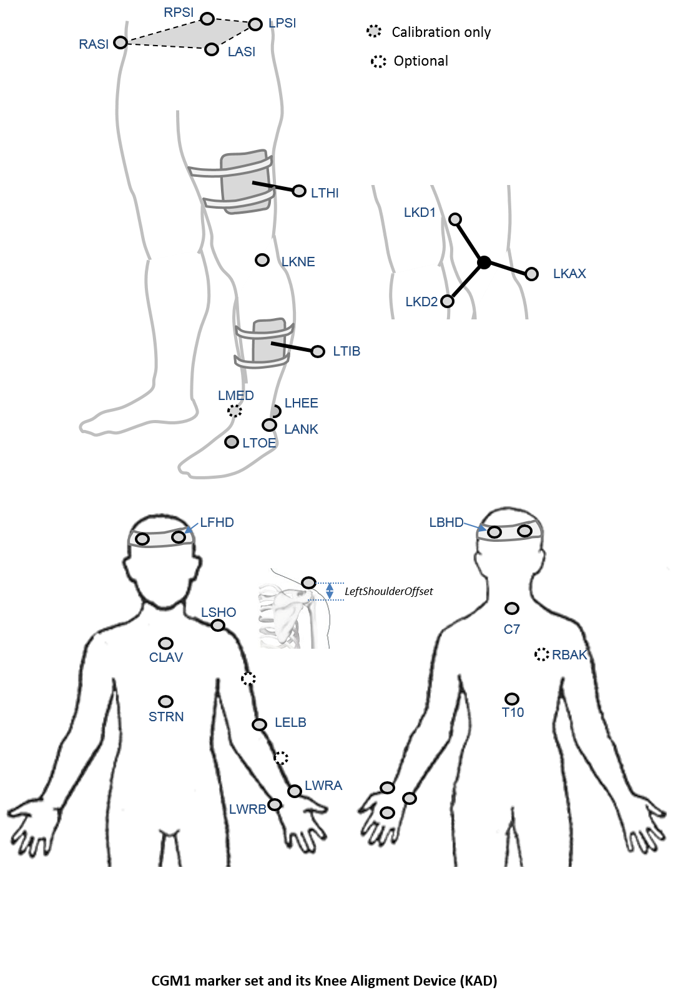

The starting point for this project has been to create a clone of the current CGM in Python. Given the sponsorship by Vicon the clone is of the current version of PiG and the first implementaiton is for this to run within the Vicon suite of  software ([Nexus](https://www.vicon.com/products/software/nexus) and [Polygon](https://www.vicon.com/products/software/polygon))

The are three principal reasons for developing and releasing this model

- as a learning exercise
- to familiarise users with running Python operations within Nexus as a foundation for working with future models.
- to allow users to see for themselves that the models give identical outputs to existing alternatives (most obviously PiG)

It should be possible to calibrate the model using static trial data and to track dynamic walking (or other) data in an exactly analogous way to how PiG runs in the Nexus pipeline at the moment (i.e. the code will detect which variant of the model should be used depending on the subject measurements that have been entered and the trajectories that are detected in the .c3d files).

The models will write outputs to the .c3d file using the same variable names as PiG. When run the models will automatically generate gait graphs of the output (overplotted on existing data if it was present).

### Marker set


An  *optional marker* is used for improving the tracking-labelling process. They do not take part in any biomechanical calculation. 
There is  no equivalent marker of RBAK on the left side. This optional marker help the autolabelling at detecting the left from the right side.


Check out our [palpation guidelines]() for getting assistance on marker placement.

### Anthropometric parameters

#### Required

* **Bodymass**: Patient mass  
* **Height**:   Patient height
* **Leg length**: Full leg length, measured between the ASIS marker and the medial malleolus, via the knee joint.  Measure with patient standing, if possible. If the patient is standing in the crouch position, this measurement is NOT the shortest distance between the ASIS and medial malleoli, but rather the measure of the skeletal leg length
* **Knee Width**:The medio-lateral width of the knee across the line of the knee axis.. Measure with patient standing, if possible.
* **Ankle Width**:The medio-lateral distance across the malleoli. Measure with patient standing, if possible.
* **Sole Thickness**:The difference in the thickness of the sole at the toe and the heel. A positive sole delta indicates that the patient’s heel is raised compared with the toe
* **Elbow Width**:Width of elbow along flexion axis (roughly between the medial and lateral epicondyles of the humerus)
* **Wrist Width**:Anterior/Posterior thickness of wrist at position where wrist marker bar is
attached. |
* **Shoulder Offset**: Vertical offset from the base of the acromion marker to shoulder joint center
|Hand Thickness|Anterior/Posterior thickness between the dorsum and palmar surfaces of the hand.

#### Optional

* **Inter-ASIS distance**: ASIS-ASIS distance is the distance between the left ASIS and right ASIS. This measurement is only needed when markers cannot be placed directly on the ASIS, for example, in obese patients
* **ASIS-Trochanter Distance**: ASIS-greater trochanter distance is the vertical distance, in the sagittal plane, between the ASIS and greater trochanter when the patient is lying supine. Measure this distance with the femur rotated such that the greater trochanter is positioned as lateral as possible.
* **Tibial Torsion**: The angle between the knee flexion and the ankle dorsi-plantar axes. The ankle is usually externally rotated with respect to the knee flexion axis. If you are using a KAD, and the medial malleoli markers are attached to the patient, Plug-in Gait calculates the tibial torsion automatically
