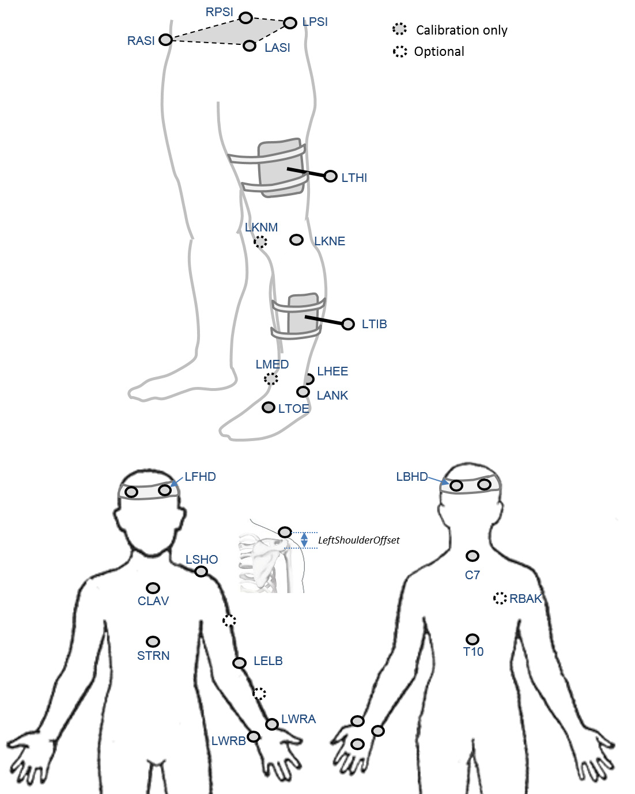

### Proposal

**CGM 2.1** is a version of the CGM which uses the regression equations of [Hara et al. 2016](http://dx.doi.org/10.1038/srep37707) to estimate the position of the hip joint centre based on a measurement of leg length taken from the measured position of markers during the static calibration trial.

A validation study from [Leboeuf et al. 2019](https://doi.org/10.1016/j.jbiomech.2019.02.010) quantifies the differences that this makes to kinematic and kinetic outputs in comparison to both the CGM 1 and the position of the hip joint centre as determined by ultrasound by reanalysis of the data originally used in the studies of [Sangeux et al. 2011](http://dx.doi.org/10.1016/j.gaitpost.2011.05.019) and [Peters et al. 2012](http://dx.doi.org/10.1016/j.gaitpost.2012.03.011).

### Background

[Leardini et al. 1999](http://dx.doi.org/10.1016/S0021-9290%2898%2900148-1) were the first to suggest that the original equations for estimating hip joint centre position as suggested by [Davis et al. 1991](http://dx.doi.org/10.1016/0167-9457%2891%2990046-Z) put the hip in the wrong position. This was confirmed by [Hicks and Richards 2005](http://dx.doi.org/10.1016/j.gaitpost.2004.08.004).
Both papers presented data suggesting that functional calibration was a better method for estimating the position of the hip joint centre.

In 2007, however, [Harrington et al.](http://dx.doi.org/10.1016/j.jbiomech.2006.02.003) produced an alternative set of predictive equations based on a large number of MRI scans. Subsequent work has shown that these perform almost as well as functional calibration in healthy adults ([Sangeux et al. 2011](http://dx.doi.org/10.1016/j.gaitpost.2011.05.019); [Sangeux et al. 2014](http://dx.doi.org/10.1016/j.gaitpost.2014.01.024)) and better in children with cerebral palsy ([Peters et al. 2012](http://dx.doi.org/10.1016/j.gaitpost.2012.03.011)). It would now appear that the original problem was with the specific equations used rather that the use of predictive equations itself.

*Accuracy of hip joint centre location: predictive equations (green) and four methods of functional calibration ([Sangeux et al. 2014](http://dx.doi.org/10.1016/j.gaitpost.2014.01.024))*

Harrington's equations are based on measurements of pelvic width (the distance between the two ASIS landmarks) and pelvic depth (the ditance between the mid-point of the ASISs and that of the PSISs) both of which can be difficult to measure, particulalry in larger people. A recent study ([Hara et al. 2016](http://dx.doi.org/10.1038/srep37707)) has shown that the location of the hip can be predicted with similar accuracy from a measurement of leg length alone. This has considerable advantages. Most obviuously, leg length is a comparatively easy measurement to make and is less sensitive to errors in estimating the position of the pelvic landmarks. The approach also, however, allows an estimate of pelvic dimensions independently of marker placement and thus provides valuable information for kinematic fitting. This should also allow scaling of the pelvic segment which is consistent with the bony geometry used in more advanced musculoskeletal models.

The inaccuracy of the original CGM hip position equations has been a cause of considerbale concern for some time. Although a paper by [Stagni et al. 2000](http://dx.doi.org/S0021-9290%2800%2900093-2) predicted that the errors are sufficient to marekdly affect hip kinetics in particular, preliminary studies of the CGM suggest that it neither the kinetics nor the kinematics is particularly sensitive to the use of different methods for calculating the hip joint centre. A more rigorous sensitivivy analysis is required but if this is confirmed then it is probable that outputs from a version of CGM using Hara's equatuons can be assumed to be compatible with the earlier version for most clinical purposes (and the validation should allow an apprecietion of any detailed differences that might be expected).

### Marker set


An  *optional marker* is used for improving the tracking-labelling process. They do not take part in any biomechanical calculation. 
There is  no equivalent marker of RBAK on the left side. This optional marker help the autolabelling at detecting the left from the right side.


Check out our [palpation guidelines]()  for get assistance on marker placement


Calibrations with either native processing (ie the wand defines  the coronal plane) or KAD can be also enable


### Anthropometric parameters

#### Required

* **Bodymass**: Patient mass  
* **Height**:   Patient height
* **Leg length**: Full leg length, measured between the ASIS marker and the medial malleolus, via the knee joint.  Measure with patient standing, if possible. If the patient is standing in the crouch position, this measurement is NOT the shortest distance between the ASIS and medial malleoli, but rather the measure of the skeletal leg length
* **Knee Width**:The medio-lateral width of the knee across the line of the knee axis.. Measure with patient standing, if possible.
* **Ankle Width**:The medio-lateral distance across the malleoli. Measure with patient standing, if possible.
* **Sole Thickness**:The difference in the thickness of the sole at the toe and the heel. A positive sole delta indicates that the patient’s heel is raised compared with the toe
* **Elbow Width**:Width of elbow along flexion axis (roughly between the medial and lateral epicondyles of the humerus)
* **Wrist Width**:Anterior/Posterior thickness of wrist at position where wrist marker bar is
attached. |
* **Shoulder Offset**: Vertical offset from the base of the acromion marker to shoulder joint center
|Hand Thickness|Anterior/Posterior thickness between the dorsum and palmar surfaces of the hand.

#### Optional

* **Inter-ASIS distance**: ASIS-ASIS distance is the distance between the left ASIS and right ASIS. This measurement is only needed when markers cannot be placed directly on the ASIS, for example, in obese patients
* **ASIS-Trochanter Distance**: ASIS-greater trochanter distance is the vertical distance, in the sagittal plane, between the ASIS and greater trochanter when the patient is lying supine. Measure this distance with the femur rotated such that the greater trochanter is positioned as lateral as possible.
* **Tibial Torsion**: The angle between the knee flexion and the ankle dorsi-plantar axes. The ankle is usually externally rotated with respect to the knee flexion axis. If you are using a KAD, and the medial malleoli markers are attached to the patient, Plug-in Gait calculates the tibial torsion automatically
