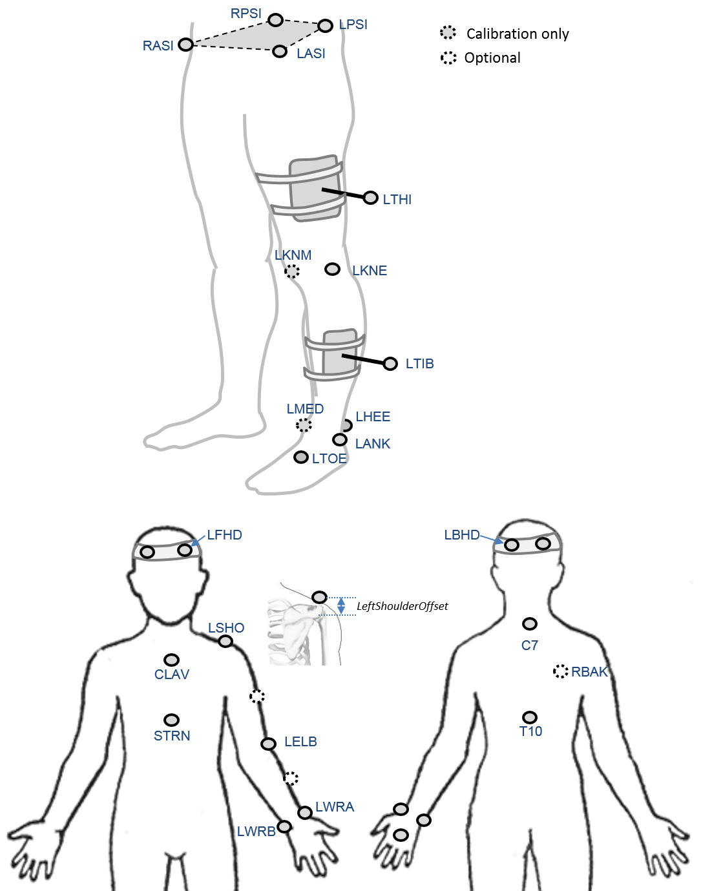

### Proposal

**CGM 2.2**  calibrates a rigid segment model to the data captured during a static trial and then use inverse kinematics to use this model to track marker trajectoris captured during the walking trial. The cost functional will be the weighted root mean square distance between modelled and measured markers. Weighting of individual markers will be determined to give an optimal match with the outputs of CGM 2.1.

This approach is likely to be prone to the effects of soft tissue aretefact at key markers (especially the lateral knee marker) which may result in a poor match with outputs from CGM2.1. It is anticipated that modifications of the markerset which will be the subject of CGM 2.3 will address this to give a better match.

### Background

As has already been commented on, the original descriptions of the CGM referred to it as “a data collection and reduction technique” ([Davis, 1981](http://dx.doi.org/10.1016/0167-9457(91%2990046-Z)) and  *an algorithm for computing lower extremity joint motion* ([Kadaba, 1990](http://dx.doi.org/10.1002/jor.1100080310)). There is a strong argument that, as originally described, the CGM, is not actually a biomechanical model.



*Linked rigid-body biomechanical model tracking measured marker positions (in yellow)*

Most contemporary biomechanical modelling uses Inverse kinematics to fit a model to a set of marker trajectories to minimise a weighted mean square difference between the modelled marker trajectories and the measured marker trajectories. The basic principals can be traced back many years (e.g. [Sommer et al. 1980](http://dx.doi.org/10.1115/1.3138228); [Lu and O'Connor, 1999](http://dx.doi.org/10.1016/S0021-9290&2898%2900158-4)) but it is only over the last decade that computing power has been sufficient for this to be practical for routine clinical implementation.

The technique has also been referred to as kinematic fitting and global optimisation ([Lu and O'Connor, 1999](http://dx.doi.org/10.1016/S0021-9290&2898%2900158-4)) within the biomechanics community but the term  *[inverse kinematics](https://en.wikipedia.org/wiki/Inverse_kinematics)* should probably be preferred as it is much more widely applied (particularly in robotics).

Rigorous biomechanical modelling, based upon inverse kinematics, is essential as a basis for the application of more advanced biomechanical techniques such as muscle length modelling ([Delp et al. 1990](http://dx.doi.org/10.1109/10.102791)), muscle force estimation ([Zajac, 1989](https://www.ncbi.nlm.nih.gov/pubmed/2676342)) or induced acceleration analysis ([Zajac et al. 2002](http://dx.doi.org/10.1016/S0966-6362%2802%2900068-1)). Relatively complex procedures are required to import the outputs of the CGM into musculoskeletal modelling packages such as [SIM](http://dx.doi.org/10.1016/0010-4825%2895%2998882-E) or [OpenSIM](http://opensim.stanford.edu/) largely because it is not a rigorous biomechanical model.

Another potential advantage of inverse kinematics is that it provides an approach for modelling soft-tissure artefact. In most previous inverse kinematics the modelled markers are assumed to be in a fixed position within a particular segment but the approach would work equally well if the markers were assumed to move in relation to those segments in some predefined manner. As an alternative inverse kinematics also allows soft-tissue artefact to be accounted for using advanced statistical procedures when performing the fit.

### Marker set


An  *optional marker* is used for improving the tracking-labelling process. They do not take part in any biomechanical calculation. 
There is  no equivalent marker of RBAK on the left side. This optional marker help the autolabelling at detecting the left from the right side.


Check out our [palpation guidelines]()  for get assistance on marker placement


Calibrations with either native processing (ie the wand defines  the coronal plane) or KAD can be also enable


### Anthropometric parameters

#### Required

* **Bodymass**: Patient mass  
* **Height**:   Patient height
* **Leg length**: Full leg length, measured between the ASIS marker and the medial malleolus, via the knee joint.  Measure with patient standing, if possible. If the patient is standing in the crouch position, this measurement is NOT the shortest distance between the ASIS and medial malleoli, but rather the measure of the skeletal leg length
* **Knee Width**:The medio-lateral width of the knee across the line of the knee axis.. Measure with patient standing, if possible.
* **Ankle Width**:The medio-lateral distance across the malleoli. Measure with patient standing, if possible.
* **Sole Thickness**:The difference in the thickness of the sole at the toe and the heel. A positive sole delta indicates that the patient’s heel is raised compared with the toe
* **Elbow Width**:Width of elbow along flexion axis (roughly between the medial and lateral epicondyles of the humerus)
* **Wrist Width**:Anterior/Posterior thickness of wrist at position where wrist marker bar is
attached. |
* **Shoulder Offset**: Vertical offset from the base of the acromion marker to shoulder joint center
|Hand Thickness|Anterior/Posterior thickness between the dorsum and palmar surfaces of the hand.

#### Optional

* **Inter-ASIS distance**: ASIS-ASIS distance is the distance between the left ASIS and right ASIS. This measurement is only needed when markers cannot be placed directly on the ASIS, for example, in obese patients
* **ASIS-Trochanter Distance**: ASIS-greater trochanter distance is the vertical distance, in the sagittal plane, between the ASIS and greater trochanter when the patient is lying supine. Measure this distance with the femur rotated such that the greater trochanter is positioned as lateral as possible.
* **Tibial Torsion**: The angle between the knee flexion and the ankle dorsi-plantar axes. The ankle is usually externally rotated with respect to the knee flexion axis. If you are using a KAD, and the medial malleoli markers are attached to the patient, Plug-in Gait calculates the tibial torsion automatically
