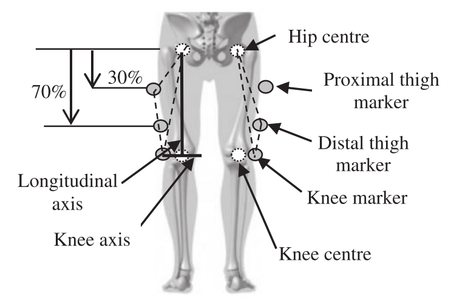
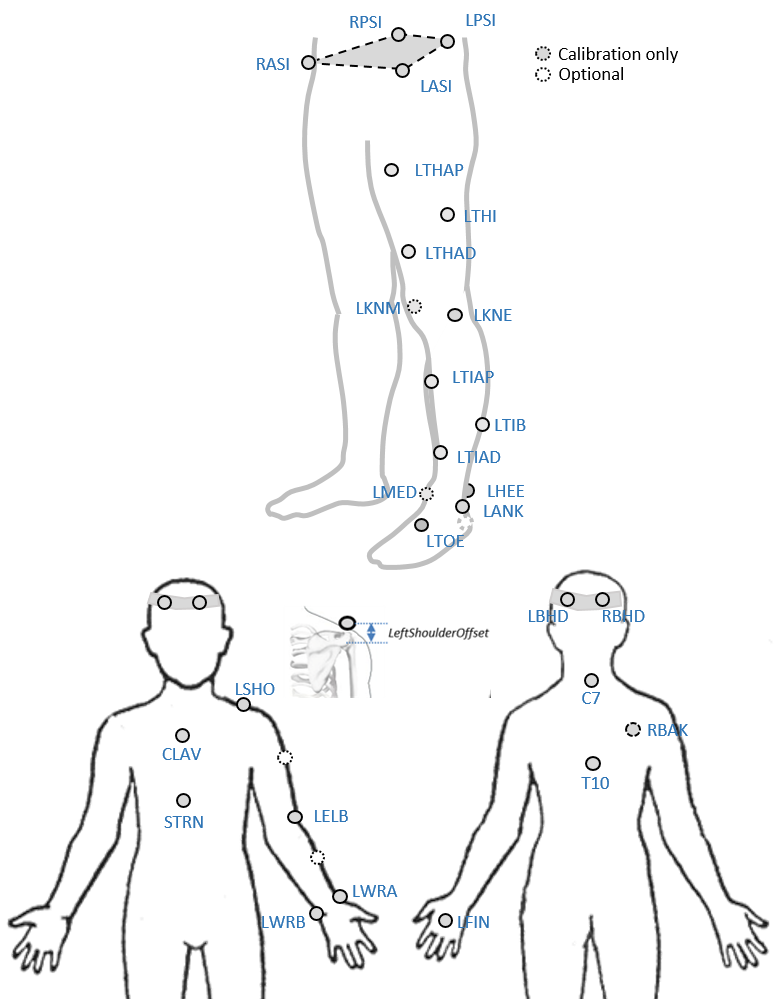

### Proposal

CGM 2.3 removes the wand markers and replaces these with a small number of tracking markers placed over the thigh and shank segments. These will be:

- Femur
  - **Proximal anterior thigh**, about 1/3 of the distance from hip to knee on anterior aspect of thigh.
  - **Distal anterior thigh**, (about 2/3 of the distance from hip to knee on anterior aspect of thigh)
  - **Lateral thigh**, about mid-way form hip to knee on lateralor aspect of thigh

  It should be noted that the skin around the knee is particularly susceptible to soft tissue artefact and that whilst **medial** and **lateral epicondyle** markers are used for calibration purposes they are not used for fitting the model to dynamic trials in this and subsequent models.

- Shank
  - **Proximal anterior crest of tibia**, just below the tibial tuberosity (where there may be some soft-tissue artefact).
  - **Middle anterior crest of tibia**, about mid way from knee to ankle on anterior crest.</li>
  - **Middle anterior crest of tibia**, about mid way from knee to ankle on anterior crest.</li>
  - **Lateral epicondyle**, as placed for conventional model.</li>
  - **Middle anterior crest of tibia**, about mid way from knee to ankle on anterior crest.</li>
  - **Medial malleolus**, as placed if used to indicate ankle joint axis during static calibration.</li>

### Background

Wand markers were originally used on the CGM because systems at the time it was developed used as few as three cameras. Putting the markers on wands ensured that they could still be seen even if segment rotation would have masked a skin mounted marker from one of the cameras. With modern systems comprising multiple high resolution cameras this is no longer a limitation and skin mounted markers can generally detected as easily as those on wands. Wands can lead to wobble on the markers if they are not securely taped in place and doing this carefully adds time to an already time consuming process.

The original CGM proposed using a wand marker for the sacrum but it is now virtually universal practice to place a skin mounted marker directly over each PSIS landmark. Thigh and shank wands, however, serve two futher purposes:

* by moving the marker laterally they make the model outputs much less sensitive to artefacts from misplacement or soft tissue artefact of both the thigh/shank and lateral knee and ankle markers. This is particular issue if the markers are placed quite distally (see Figure below).

The wands help visualise exactly where a marker is being placed and, if wands with ball joint bases are used, allow subtle adjustments of where the centre of the marker lies with respect to the coronal plane of the femur. This is particularly important if the position of these markers is used to directly determine the coronal plane alignemnt of the femure and shank (i.e. if a knee alignment device of some form of functional calibration is not used).

Whilst it would be extremely useful, therefore, to use skin mounted markers only, it does not make sense to simply replace each wand with a single skin mounted marker in approximately the same position. [Peters et al. 2009](http://dx.doi.org/10.1016/j.gaitpost.2008.06.007) have suggested markers palced on the medial and lateral malleoli and on the anterior crest of the tibia that appear to show very little soft tissue artefact and are suitable placements for tibial markers. [Cockroft et al. 2016](http://dx.doi.org/10.1080/10255842.2016.1157865)) suggest that use of a more proximal thigh marker makes model outputs less prone to soft tissue artefact and reasoning similar to that presented in the paper suggests that a marker placed in on the mid-line of the anterior aspect of the thigh is likely to be a good placement as well.

### Marker set

Figure below illustrates the CGM2.3 marker set for one limb only for clarity(adapted from [Peters et al. 2009](http://dx.doi.org/10.1016/j.gaitpost.2008.06.007))


An  *optional marker* is used for improving the tracking-labelling process. They do not take part in any biomechanical calculation. 
There is  no equivalent marker of RBAK on the left side. This optional marker help the autolabelling at detecting the left from the right side.


Check out our [palpation guidelines](Palpation.html) for get assistance on marker placement


Calibrations with either native processing (ie the wand defines  the coronal plane) or KAD can be also enable


### Anthropometric parameters

#### Required

* **Bodymass**: Patient mass  
* **Height**:   Patient height
* **Leg length**: Full leg length, measured between the ASIS marker and the medial malleolus, via the knee joint.  Measure with patient standing, if possible. If the patient is standing in the crouch position, this measurement is NOT the shortest distance between the ASIS and medial malleoli, but rather the measure of the skeletal leg length
* **Knee Width**:The medio-lateral width of the knee across the line of the knee axis.. Measure with patient standing, if possible.
* **Ankle Width**:The medio-lateral distance across the malleoli. Measure with patient standing, if possible.
* **Sole Thickness**:The difference in the thickness of the sole at the toe and the heel. A positive sole delta indicates that the patient’s heel is raised compared with the toe
* **Elbow Width**:Width of elbow along flexion axis (roughly between the medial and lateral epicondyles of the humerus)
* **Wrist Width**:Anterior/Posterior thickness of wrist at position where wrist marker bar is
attached. |
* **Shoulder Offset**: Vertical offset from the base of the acromion marker to shoulder joint center
|Hand Thickness|Anterior/Posterior thickness between the dorsum and palmar surfaces of the hand.

#### Optional

* **Inter-ASIS distance**: ASIS-ASIS distance is the distance between the left ASIS and right ASIS. This measurement is only needed when markers cannot be placed directly on the ASIS, for example, in obese patients
* **ASIS-Trochanter Distance**: ASIS-greater trochanter distance is the vertical distance, in the sagittal plane, between the ASIS and greater trochanter when the patient is lying supine. Measure this distance with the femur rotated such that the greater trochanter is positioned as lateral as possible.
* **Tibial Torsion**: The angle between the knee flexion and the ankle dorsi-plantar axes. The ankle is usually externally rotated with respect to the knee flexion axis. If you are using a KAD, and the medial malleoli markers are attached to the patient, Plug-in Gait calculates the tibial torsion automatically
