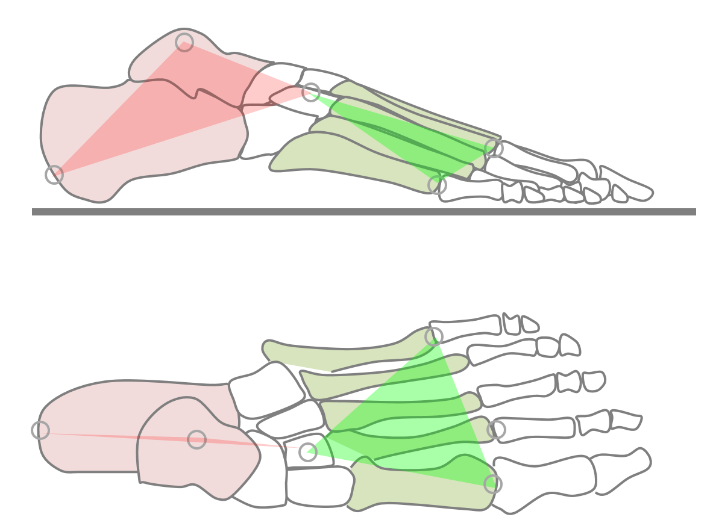
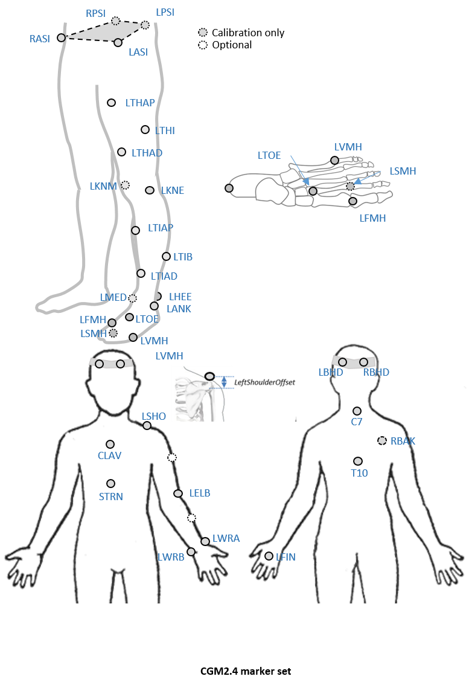

### Proposal

A two segment foot model is introduced with the rear segment being a modification of the CGM foot segment and the forefoot being a modification of that of the Oxford Foot Model.

* Given the difficulty of tracking small segments within the foot only two segments will be defined.
* For backward compatibility the rear-foot segment will be an adaptation of the CGM1 foot segment created by recommending a proximal placement of the forefoot marker (at the level of the cuneiform bones). The heel marker will be used to give an indication of rotation about the long axis of this segment.
* A forefoot segment linked to the the rear-foot segment by a ball and socket joint will be added. This will be defined principally by markers on the first and fifth metatarsal heads.
* The long axis of this segment will run from the mid-foot joint towards the second toe using a calibration marker placed on the 2nd metatarsal-phalangeal joint.

### Background

Because of limitations in data capture technology the original CGM only ever considered the foot as a line segment giving information on the orientation of its long axis but not on any rotation around that axis. During the development of PiG, the heel marker (if left on during dynamic trials) started to be used to calculate rotation about the long axis but this has never been properly validated. There is also currently some variability in where the toe marker is placed. Most labs place it quite distally at about the level of the metatarsopahalangeal joint to give an impression of the overall alignment of the foot but others place it more proximally, at the level of the cuneiform bones to give more of an impression of hindfoot alignment ([Baker 2013](http://eu.wiley.com/WileyCDA/WileyTitle/productCd-1908316667,subjectCd-HE90.html)).

Over the years a wide variety of alternative foot models have been developed ([Deschamps et al. 2011](http://dx.doi.org/10.1016/j.gaitpost.2010.12.018)) of which the Oxford Foot Model ([Carson et al. 2001](http://dx.doi.org/10.1016/S0021-9290%2801%2900101-4); [Stebbins et al. 2006](http://dx.doi.org/S0966-6362%2805%2900037-8 )) and <em>Istituti Ortopedici Rizzoli</em> (IOR, [Leardini et al. 1999](http://dx.doi.org/10.1016/S0268-0033%2899%2900008-X)) are probably the most widely used. Neither, however, can be incoporated easily within the CGM or follows its design philosophy.

A particular issue of foot models is that because the segments are small the markers are close together and this makes the resulting segment definitions highly sensitive to small marker misplacement errors. This is particularly problematic as both the between subject variability in the alignment of foot segments and the range of movement between the segments are both small and thus precise measurements will be needed to detect abnormality. As a consequence foot models are most often used clinically to give a broad indication of the nature of quite gross deformations,

### Marker set


An  *optional marker* is used for improving the tracking-labelling process. They do not take part in any biomechanical calculation. 
There is  no equivalent marker of RBAK on the left side. This optional marker help the autolabelling at detecting the left from the right side.


Check out our [palpation guidelines](Palpation.html) for get assistance on marker placement


Calibrations with either native processing (ie the wand defines  the coronal plane) or KAD can be also enable


### Anthropometric parameters

#### Required

* **Bodymass**: Patient mass  
* **Height**:   Patient height
* **Leg length**: Full leg length, measured between the ASIS marker and the medial malleolus, via the knee joint.  Measure with patient standing, if possible. If the patient is standing in the crouch position, this measurement is NOT the shortest distance between the ASIS and medial malleoli, but rather the measure of the skeletal leg length
* **Knee Width**:The medio-lateral width of the knee across the line of the knee axis.. Measure with patient standing, if possible.
* **Ankle Width**:The medio-lateral distance across the malleoli. Measure with patient standing, if possible.
* **Sole Thickness**:The difference in the thickness of the sole at the toe and the heel. A positive sole delta indicates that the patient’s heel is raised compared with the toe
* **Elbow Width**:Width of elbow along flexion axis (roughly between the medial and lateral epicondyles of the humerus)
* **Wrist Width**:Anterior/Posterior thickness of wrist at position where wrist marker bar is
attached. |
* **Shoulder Offset**: Vertical offset from the base of the acromion marker to shoulder joint center
|Hand Thickness|Anterior/Posterior thickness between the dorsum and palmar surfaces of the hand.

#### Optional

* **Inter-ASIS distance**: ASIS-ASIS distance is the distance between the left ASIS and right ASIS. This measurement is only needed when markers cannot be placed directly on the ASIS, for example, in obese patients
* **ASIS-Trochanter Distance**: ASIS-greater trochanter distance is the vertical distance, in the sagittal plane, between the ASIS and greater trochanter when the patient is lying supine. Measure this distance with the femur rotated such that the greater trochanter is positioned as lateral as possible.
* **Tibial Torsion**: The angle between the knee flexion and the ankle dorsi-plantar axes. The ankle is usually externally rotated with respect to the knee flexion axis. If you are using a KAD, and the medial malleoli markers are attached to the patient, Plug-in Gait calculates the tibial torsion automatically
