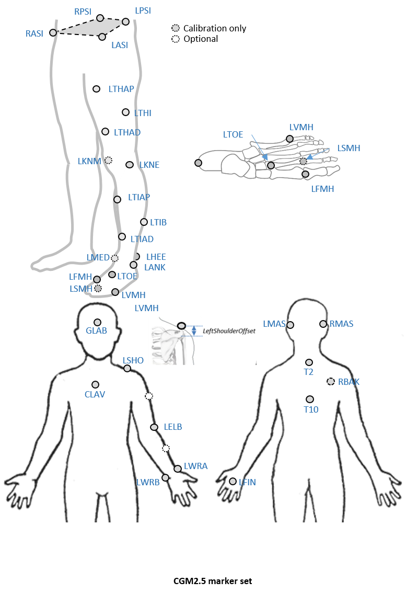

### Proposal

CGM 2.5 uses three markers proposed by [Armand et al. 2014]( http://dx.doi.org/10.1016/j.gaitpost.2013.06.016) (Sternum, T2, T10) to track the thorax which will be linked to the pelvis by a ball joint at the lumbar sacral joint. Testing will be perfromed to quantify the effect this has on how the lower limbs and trunk are tracked.

The approach of [Eames et al. 1999](http://dx.doi.org/10.1016/S0167-9457%2899%2900022-6) will be used to track the head and arms to give a broad impression of their orientation. Markers will be given a low weighting in the tracking cost function to ensure that tracking these segments has a minimal effect on the tracking of other more important segments.

### Background

Although many gait analysis services include some sort of analysis of upper body movement as part of their standard analysis there has been much less consistency in which model is used than for the lower limb. No upper body model for clinical gait analysis has been rigorously validated. Applying extra markers accurately to the trunk, head and arms can add extra time to an analysis and is often not justified by the clinical use that is made of the data.

As [Perry](https://books.google.co.uk/books?id=DICTQAAACAAJ&source=gbs_book_other_versions) noted the Head, Arms and Trunk (HAT) can be thought of as a <em>passenger segment</em> and understanding how this is carried by the les or <em>locomotor unit</em> is essential to understand the mechanics of gait. It is not all clear how much detail is required. Given that most of the mass of the upper body is within the trunk it can be assumed that an accurate understanding of this location is essential. The orientation of the head and arms is less important and a general overview of these may be all that is required.

### Marker set


An  *optional marker* is used for improving the tracking-labelling process. They do not take part in any biomechanical calculation. 
There is  no equivalent marker of RBAK on the left side. This optional marker help the autolabelling at detecting the left from the right side.


Check out our [palpation guidelines]()  for get assistance on marker placement


Calibrations with either native processing (ie the wand defines  the coronal plane) or KAD can be also enable


### Anthropometric parameters

#### Required

* **Bodymass**: Patient mass  
* **Height**:   Patient height
* **Leg length**: Full leg length, measured between the ASIS marker and the medial malleolus, via the knee joint.  Measure with patient standing, if possible. If the patient is standing in the crouch position, this measurement is NOT the shortest distance between the ASIS and medial malleoli, but rather the measure of the skeletal leg length
* **Knee Width**:The medio-lateral width of the knee across the line of the knee axis.. Measure with patient standing, if possible.
* **Ankle Width**:The medio-lateral distance across the malleoli. Measure with patient standing, if possible.
* **Sole Thickness**:The difference in the thickness of the sole at the toe and the heel. A positive sole delta indicates that the patient’s heel is raised compared with the toe
* **Elbow Width**:Width of elbow along flexion axis (roughly between the medial and lateral epicondyles of the humerus)
* **Wrist Width**:Anterior/Posterior thickness of wrist at position where wrist marker bar is
attached. |
* **Shoulder Offset**: Vertical offset from the base of the acromion marker to shoulder joint center
|Hand Thickness|Anterior/Posterior thickness between the dorsum and palmar surfaces of the hand.

#### Optional

* **Inter-ASIS distance**: ASIS-ASIS distance is the distance between the left ASIS and right ASIS. This measurement is only needed when markers cannot be placed directly on the ASIS, for example, in obese patients
* **ASIS-Trochanter Distance**: ASIS-greater trochanter distance is the vertical distance, in the sagittal plane, between the ASIS and greater trochanter when the patient is lying supine. Measure this distance with the femur rotated such that the greater trochanter is positioned as lateral as possible.
* **Tibial Torsion**: The angle between the knee flexion and the ankle dorsi-plantar axes. The ankle is usually externally rotated with respect to the knee flexion axis. If you are using a KAD, and the medial malleoli markers are attached to the patient, Plug-in Gait calculates the tibial torsion automatically
