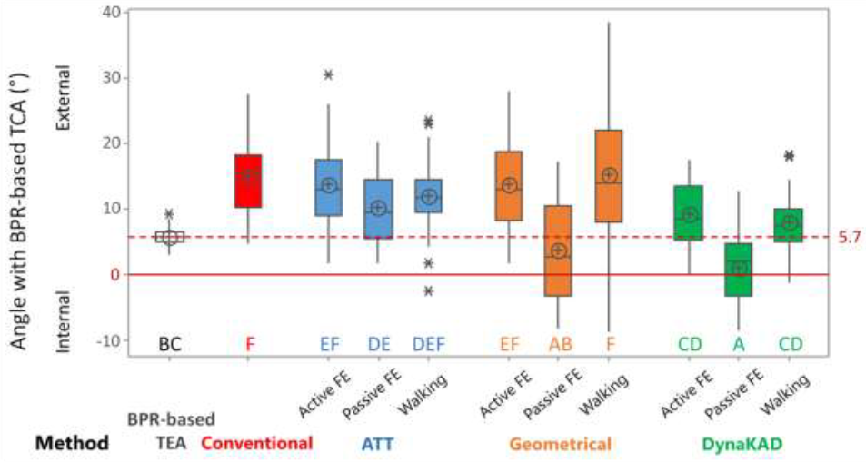

### Proposal

CGM 2.6  incorporates functional calibration of the knee joint based upon a dynamic functional calibration test conducted after static calibration but before fitting the model to walking trials. The software will run on any .c3d trial that includes a sufficient range of knee movement to allow calibration but clinical recommendations will focus on non-weight bearing knee flexion conducted with or without the assistance of a gait analyst.

### Background

The difficulty in defining the coronal plane of the thigh was first discussed by [Ramakrishnan et al. 1991](http://dx.doi.org/0021-9290%2891%2990175-M) and has been a challenge for clinical gait analysts ever since. ALthough there is less evidence to support the claim, models based upon the CAST technique ([Cappozzo et al. 1995]( http://dx.doi.org/10.1016/0268-0033%2895%2991394-T))  are generally assumed to be more robust to this error than the CGM. Allowing a calibration marker on the medial epicondyle has thus been introduced in CGM1.1 and is expected to bring the CGM into line with the other models. Given the importance of hip rotation in many clinical analyses however this is unlikley to be sufficient.

Although the coronal plane of the femur within the CGM is defined as that containing the medial and lateral epicondyles it is generally well established that the transepicondylar axis is aligned with the functional axis for knee flexion to within the accuracy attainable using marker based gait analysis and thus functional calibration appears to offer a solution. A variety of approaches have been proposed ([Baker et al. 1999](http://dx.doi.org/10.1016/S0167-9457%2899%2900027-5); [Schwartz & Rozumalski, 2005]( http://dx.doi.org/10.1016/j.jbiomech.2004.03.009); [Ehrig et al, 2007](http://dx.doi.org/S0021-9290%2806%2900415-5)). Until recently these had been validated by a number of essentially technical measures without reference to any gold standard.

*Analysis of different methods of knee calibration ([Sauret et al. 2016](http://dx.doi.org/10.1016/j.gaitpost.2016.09.008))*

Three very recent studies however ([Passmore & Sangeux, 2016](http://dx.doi.org/10.1016/j.gaitpost.2016.02.006); [Sangeux et al. 2016](http://dx.doi.org/10.1016/j.jbiomech.2016.10.049) and [Sauret et al. 2016](http://dx.doi.org/10.1016/j.gaitpost.2016.09.008)) have compared techniques with anatomical reference data. All confirmed that the functional calibration was effective and that the simplest method (minimising the standard deviation of the coronal plane cross-talk, [Baker et al. 1999](http://dx.doi.org/10.1016/S0167-9457%2899%2900027-5)) was at least as effective as later methods).
