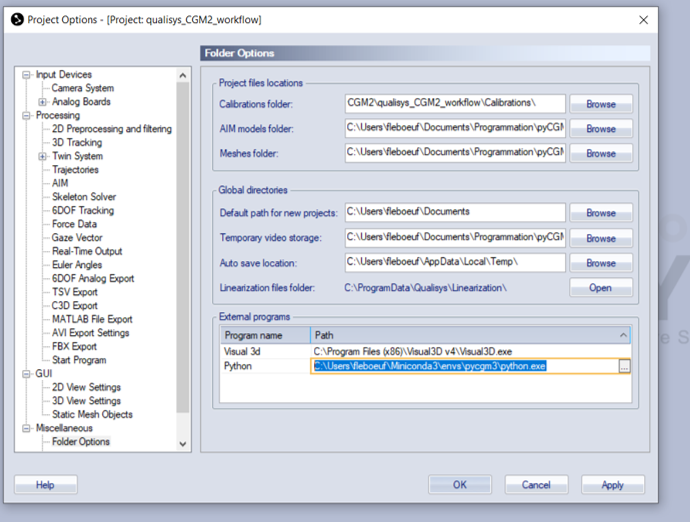

### Install from source



* download the last pycgm2 release ( [version 4.0.2-beta](https://github.com/pyCGM2/pyCGM2/releases/tag/version(4.0.2)-beta))
* go to you local downloaded zip file and unzipped it ( place it wherever)
* open the *miniconda prompt*
* activate your virtual python environment with `activate pycgm3`
* go to your local unzipped folder ( folder with the file *setup.py*)
* type `python setup.py install`
* check import of pycgm2, type:
  * `python` to open a python
  * `import pyCGM2`

The installation  :

* generates **scripts** into the virtual environment ( here pycgm3) folder *PATHTO\\Miniconda3\\envs\\pycgm3\\Scripts*)
* creates a folder *C:\\programData\\pycgm2* and gathers in **settings**

#### For Vicon Nexus Users

The installation detects your Vicon Nexus version and populates *C:\\Users\\Public\\Documents\\Vicon\\Nexus2.x*
with pre-defined nexus pipelines and nexus skeleton (vst files)


if you want to use pre-defined nexus pipelines instead of the miniconda console, you need to **add your virtual environment to your window path**


#### For QTM Users

**Requirements**

* Download the [CGM2-QTM project sample](https://github.com/pyCGM2/qualisys_CGM2_workflow)
  - unzip it and copy-paste in an appropriate folder

* Download [Mokka](https://storage.googleapis.com/google-code-archive-downloads/v2/code.google.com/b-tk/Mokka-0.6.2_win64.zip):
  - Unzip Mokka and **add location of Mokka.exe to "Path" environment variable.**

<!-- For an external use of the pyCGM2 package, you need to point the QTM project option to your virtual environment.

Go to *Tools/project options* and amend the python line of the external programs box, as illustrated :   

 -->
