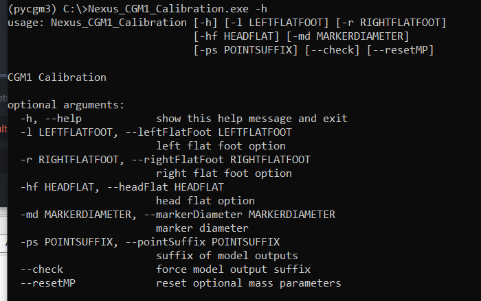

To know the input arguments of each script,

* open the miniconda Console
* type the script name followed by `-h` or `--help`.

For instance, if you type `Nexus_CGM1_Calibration.exe -h` or `Nexus_CGM1_Calibration.exe --help`, you get input arguments of the CGM1 calibration script.

## How to read the input argument help

In the above figure, you can how to call arguments in the **usage** line.

You can call shortcut ( specify by the single dash) or the explicit option name ( specified by the double dash).

For instance, you can type :

* `Nexus_CGM1_Calibration.exe -l 0 -md 16 -ps cgm1`

equivalent to

* `Nexus_CGM1_Calibration.exe --leftFlatFoot 0 --marrkerDiameter 16 --pointSuffix cgm1`)

 
