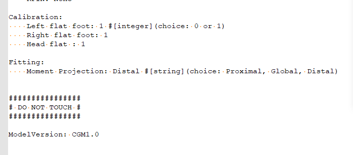

The **Settings** folder located in the *C:\\programData\\pycgm2* initiated pyCGM2 scripts. For instance the file `CGM1-pyCGM2.settings` gathers default options of the CGM1,


**These *-pyCGM2.settings* are representative of your routine**. As you can see in the  above illustration, the flat foot options are enable ( the longitudinal axis of the foot is set parallel to the ground), the joint moments are projected into the Distal segment (ie default option of the Vicon Plugin gait) .


### What to do if your gait analysis does not match the predefined settings   

For instance, if your patient has a left equinus foot in static pose, you cannot apply the default settings. You need to disable the left flat foot option.

There are two options :

1. copy paste the *#model#-pyCGM2.settings* into the patient data folder. Then amend the copied file.
2. use the input arguments of the python script
