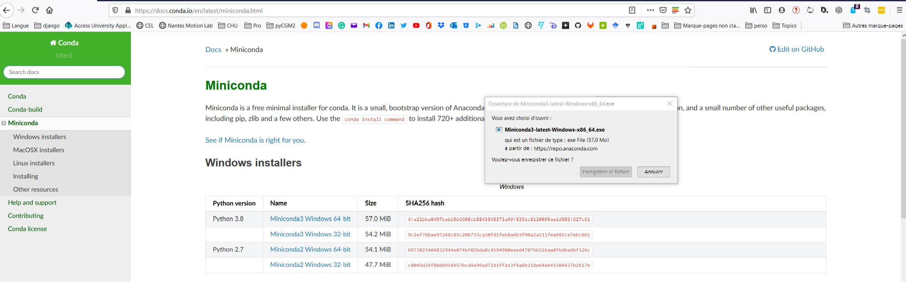
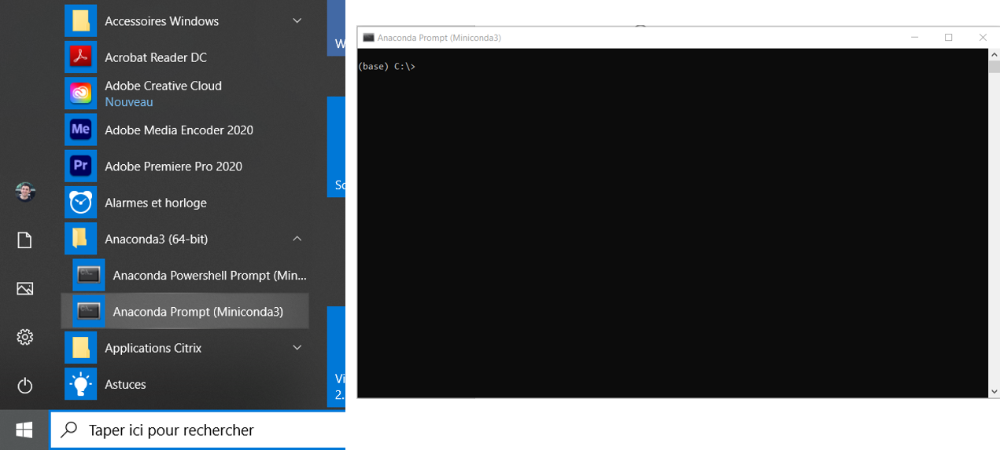
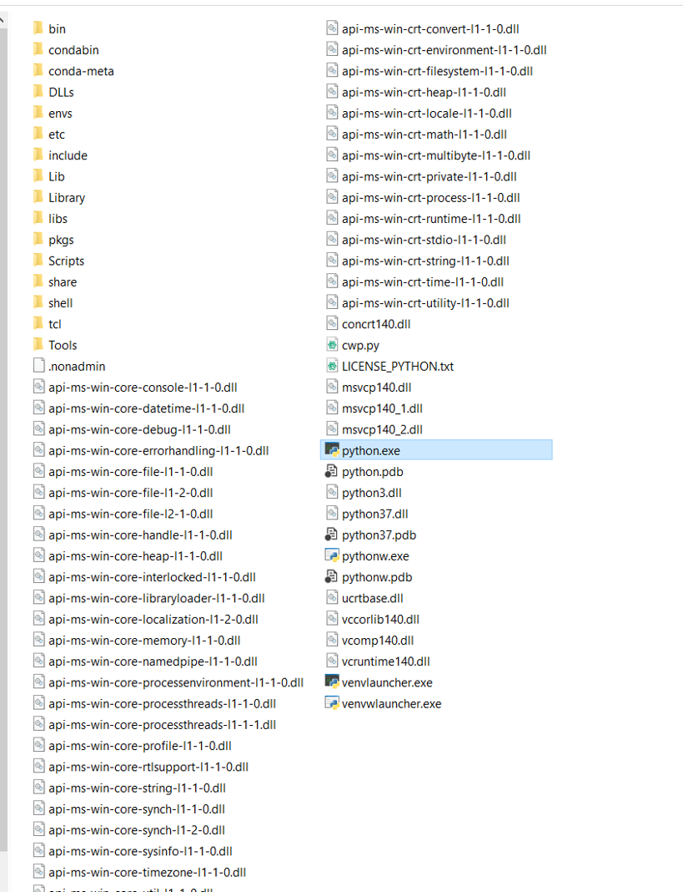


  pyCGM2 is implemented in **python 3.7-64bits** under **Microsoft Windows 10**.
  This documentation only describes Microsoft Windows use of pyCGM2.     


### Installation of your python environment

If you have not installed any python environment yet, we recommand to install the **miniconda** python suite.

* go to miniconda [download page](https://docs.conda.io/en/latest/miniconda.html)
* download the last 64 bits windows version

* run the downloaded file and follow installation with default argument.  

Once installed, You will see **the Anaconda-64 bits** in you start menu. This directory contains the **anaconda prompt (miniconda)** which will be use to run our python script.


  Notice the last version is not a python 3.7 ! To make your environment compatible with pyCGM2, you need to create a **virtual python environment**  


### Creation of a virtual environment

The goal is to create a virtual python 3.7 inside your *python 3.i*  miniconda environment    

As described in this video



* open the **anaconda prompt (miniconda)**
* type `conda create --name pycgm3 python=3.7`.  This commands create a virtual environment named *pycgm3*.
* type `activate pycgm3` to enable your environment

This procedure ends up with a directory named *pycgm3* inside the directory *PATHTO\\Miniconda3\\envs*.

* Check out the content of the *pycgm3* directory. It contains the python3.7 executable (*python.exe*)

