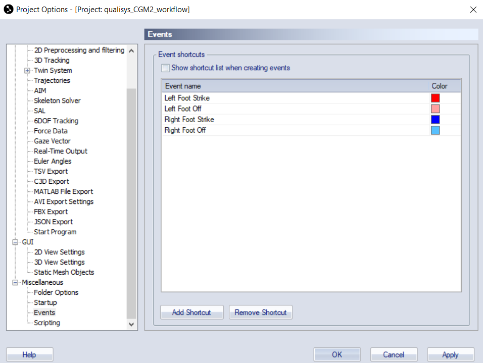
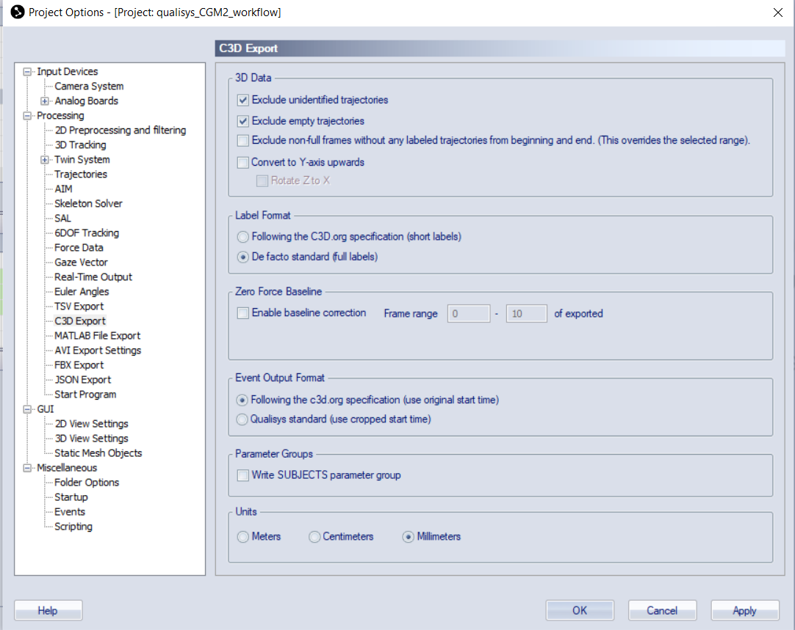
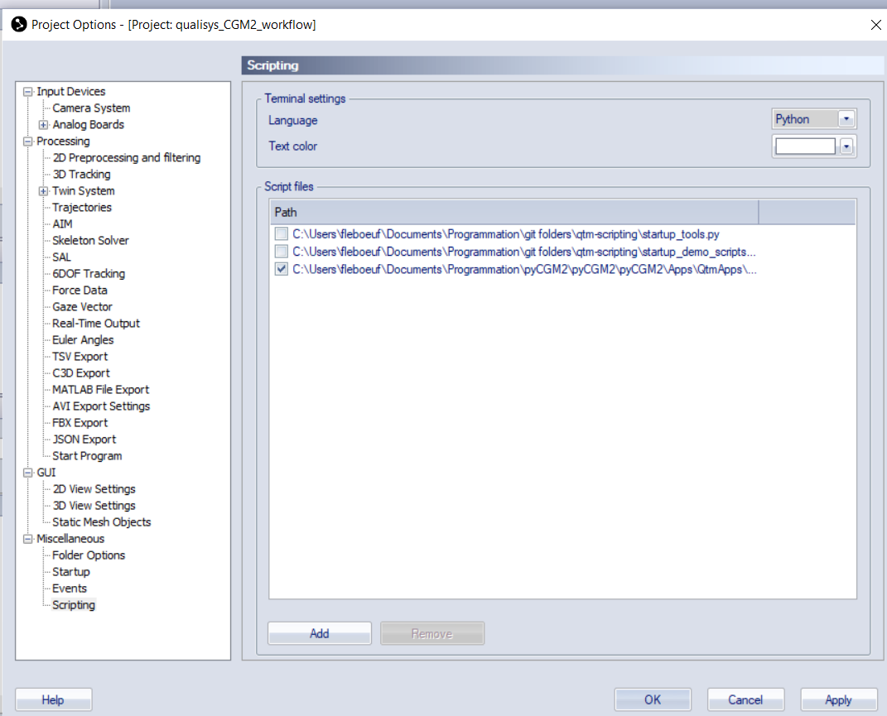


  pyCGM2 is implemented for **python 3.7 to python 3.11**. installation was tested for **Microsoft Windows 10**.


This flowchart presents the different installation stages whether you are a Vicon or a QTM user.


<center>
<figure>

flowchart LR
   id00[setup python]
   id0[create a virtual environment]
   id00-->id0
   subgraph pyCGM2_Install
    id1[install pycgm2 from conda]
    subgraph developper
    direction TB
    id2[download source code]
    id3[install pyCGM2]
    end
   end 
   id2-->id3
   id1---|or|developper
   id0-->pyCGM2_Install
   subgraph ViconUser
   id4[install nexus API]
   end
   pyCGM2_Install-->ViconUser
   subgraph QTMUser
   id5[setup QTM project]
   end
   pyCGM2_Install-->QTMUser

</center>


### create your virtual environment

Launch the **anaconda prompt (miniconda)**, then, for creating a python 3.9 virtual environment, names `pycgm39` , type the commands :

```bash
conda create --name pycgm39 python=3.9
conda activate pycgm39
```

the second line activate the `pycgm39` environement


Find out more about virtual environment :

 * [why-you-should-use-a-virtual-environment](https://towardsdatascience.com/why-you-should-use-a-virtual-environment-for-every-python-project-c17dab3b0fd0) for every python project

### pyCGM2 Installation

A ready to install package is available in the [pyCGM2 conda channel](https://anaconda.org/pyCGM2), 

To install it, Launch the **anaconda prompt (miniconda)**,  type the commands :

```bash
conda activate pycgm39
conda install -c pycgm2 pycgm2
```

The former command installs the package in the folder `PATH_TO_MINICONDA\envs\pycgm39\Lib\site-packages`

#### developper mode

First, you need to download the pyCGM2 source code on your laptop. you have 2 options

 * download  the last  [release]( https://github.com/pyCGM2/pyCGM2/releases) , then unzipping it 
or
 * clone the github [master branch](https://github.com/pyCGM2/pyCGM2) with your subversion software (github desktop, sourceTree, ...)

Launch the **anaconda prompt (miniconda)**,  type the commands :

```bash
conda activate activate pycgm39
cd C:/PATH/TO/YOUR/LOCAL/PYCGM2/FOLDER
conda install btk
conda install -c opensim-org opensim
pip install -e .
```

`pip install -e .` is used to install a Python package through pip in "editable" mode. The -e flag indicates that the package should be installed in a way that any changes made to its source code will immediately affect the installed version. The . (dot) signifies that the package to be installed is located in the current directory. This is especially useful for developers who want to test changes to a package without repeatedly reinstalling it


### For vicon users -  install the Nexus API

If you are a **Vicon Nexus User**, type the command below to enable interaction with Vicon Nexus

```bash
cd C:\Program Files\Vicon\Nexus2.15\SDK\Win64\Python
install_vicon_nexus_api.bat
install_vicon_nexus_utils.bat
```
*note:* 
 
 * this commands may require to be run in **administrator mode**
 * installer only tested from nexus 2.15


### For QTM users -  setup a pyCGM2 project


pyCGM2-QTM interactions leverages from [QTM scripting](https://qualisys.github.io/qtm-scripting/2023.3/index.html) and is only available from pyCGM2 version 4.3-rc3. The implementation  may be subject to modifications. 



Here is the flowchart to configure pyCGM2 with QTM
<center>
<figure>

flowchart LR
  id0[download/clone a pycgm2 QTM project]

  subgraph Configure_QTM
    id1[add event shortcuts]
    id2[configure c3d export]
    id3[enable pycgm2 menu]
  end
  id1-->id2-->id3
  id0--->Configure_QTM



</center>


#### Download/clone a pycgm2 QTM project

Download or clone a [pyCGM2 QTM project](https://github.com/pyCGM2/qualisys_CGM2_workflow)


#### Configure_QTM

**add event shorcuts**

  - go to *Tools/project options*.
  - in the tree view, go to *Miscellaneous/Events* and add event shorcuts as described in this image 

  

**configure c3d export**

  - go to *Tools/project options*.
  - in the tree view, go to *Processing/C3d export* and amend the settings to match those described in this image 

  

  **enable pycgm2 menu**

  - go to *Tools/project options*.
  - in the tree view, go to *Miscellaneous/Scripting* , add a script
  - add the script `pycgm2-scripting.py` located in the folder `pyCGM2\Apps\QtmApps\qtm-scripting\`
  - tick the script and apply it

  

eventually, the pycgm2 menu will appear in the menu toolbar.