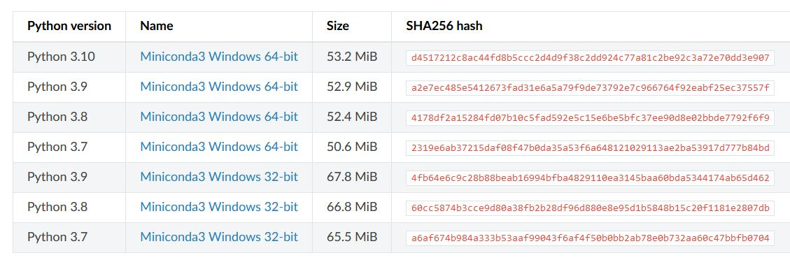
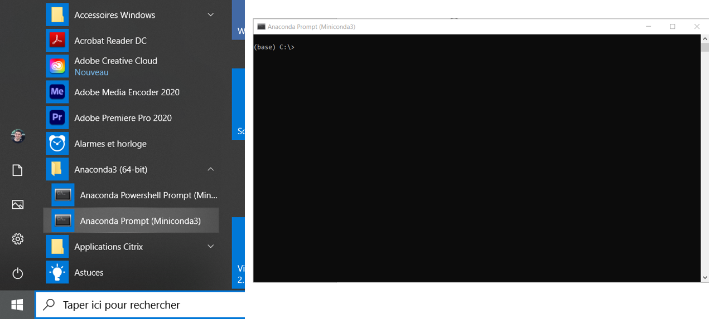


  pyCGM2 is implemented for **python 3.7 to python 3.9** under **Microsoft Windows 10**.


First, we recommand to install the **Miniconda** python distribution.  Then, **optionaly**, we also recommand to create a virtual python environment to isolate your pycgm2 project from other projects and applications on your system.

## Miniconda installation

* go to miniconda [download page](https://docs.conda.io/en/latest/miniconda.html)
* download one of the last 64 bits windows python 3.7,3.8 or 3.9 version ( not over 3.9 )

* run the downloaded file and follow installation with default argument.  

Once installed, You will see **the Anaconda-64 bits** in you start menu. This directory contains the **anaconda prompt (miniconda)** which will be use to run our python script.

## **[Optional]** Create a python virtual environnement 

* open the **anaconda prompt (miniconda)**
* type `conda create --name pycgm39 python=3.9`.  This commands create a virtual environment named *pycgm39*.
* type `activate pycgm39` to enable your environment

Here is a video, that describe how to create a virtual python 3.7 environement named  `pycgm3`. 



## some python readings 

 * [why-you-should-use-a-virtual-environment](https://towardsdatascience.com/why-you-should-use-a-virtual-environment-for-every-python-project-c17dab3b0fd0) for every python project
 * [learning python for biomechanics](https://kineticstoolkit.uqam.ca/doc/python_for_beginners.html) written by Felix Chenier (UQAM, Montréal)

