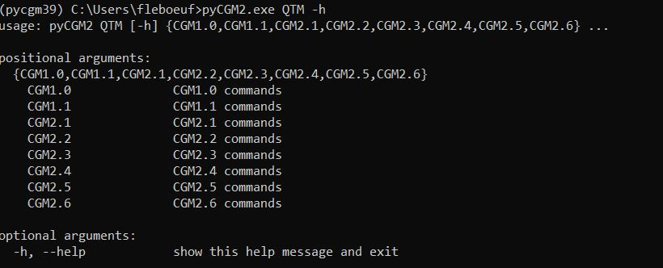

All available Nexus apps can be displayed with the command

`pycgm2.exe QTM -h`

## Quickstart

Check out this video to see how to run the CGM2.1 QTM workflow 



Here are the subsequent steps described in the video :
  * open Qtm and load your project
  * generate the   `session.xml` file, 
  * open anaconda prompt console 
  * (optional) activate your python environment  `activate pycgm39` ( here i activate the python 3.9 version of pycgm2)
  * Go to your data folder in the console with the current directory command `cd` 
  * run `pyCGM2.exe QTM CGM2.1`
  

The section  [Vicon apps]()  presents the different scripts callable from the command `pyCGM2.exe QTM`

## Commands

you will see, we propose QTM workflows for each CGM

The procedure to run a CGM workflow is 

* open QTM
* select the CGM2 projet
* open  *miniconda prompt*
* activate your pycgm2 virtual environment (type  `activate pycgm39`)
* [QTM] generate your session.xml
  * select *Generate Session* in the *start processing* menu
* go to your data folder.   
* run  `pycgm2.exe QTM CGM1.0` to run the CGM1.0 workflow

This process sucessively:

 * generate session.xml
 * Export c3d files
 * Detect static and dynamic trials according the attribute type of the `session.xml` node : measurement
 * Detect events according Zeni's algorithm
 * Automatically open Mokka to for checking events 
 * run kinematic and kinetic calculation
 * Export plots as pdf pages (stored in the subsession folder *processed*)
