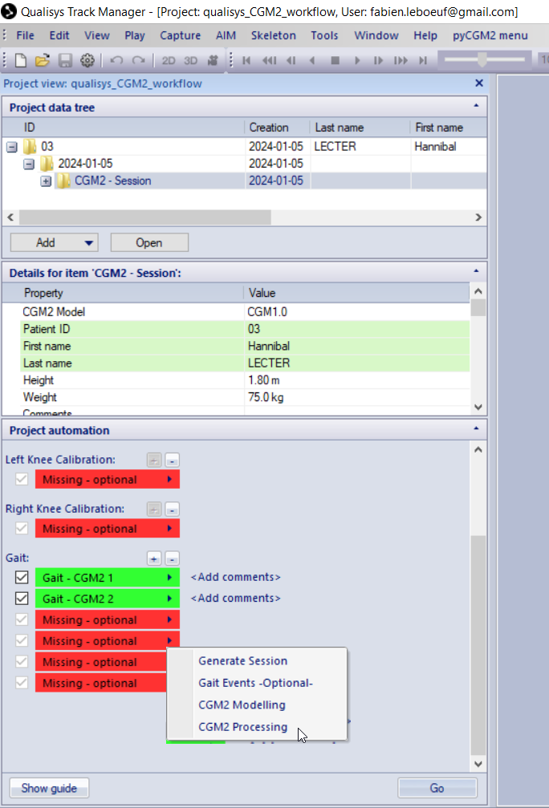
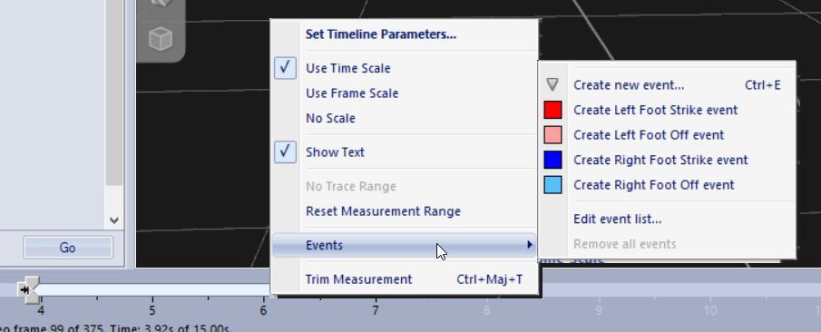
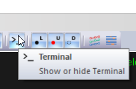
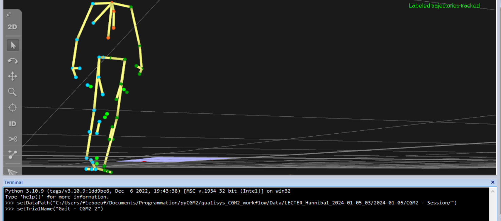
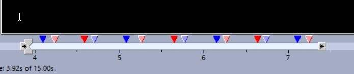
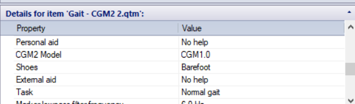

<div class="alert alert-dismissible alert-danger">
 <p> The major update in pyCGM2 version 4.3 is the removal of Mokka from the processing workflow, which was previously used to refine gait event detection. We now believe that it is better to perform these adjustments directly in QTM. </p>
 <p class="text-danger">Therefore, we recommend manually editing the gait events for each trial.</p>
 <p> While pyCGM2 incorporates the Zeni algorithm for automatic event detection, its implementation in QTM is not optimal. The QTM API operates solely in 32 bits and cannot incorporate pyCGM2, which is developed in 64 bits, as an external library. We will remain vigilant for any changes to the QTM API that could facilitate integrated processing in pyCGM2</p>  
 
  <p class="mb-0"></p>
</div>

### The QTM interface

This figure illustrates the QTM user interface and the content of the *start processing* button




### The QTM-PyCGM2 flowchart

here is the flowchart of pyCGM2-QTM workflow

<center>
<figure>

flowchart LR
  
  generate[run *generate session*]

  subgraph events[Gait events]
    direction LR

    subgraph manual[manual edition]
      direction TB
      events1[load a gait trial]
      events11[add events in the time bar]
     end
     events1-->events11
     
    subgraph zeni[zeni's detection]
      direction TB
      events2[run *Gait Events*]
      events21[open the QTM terminal]
      events22[type: setDataPathDATA_PATH_FOLDER]
      events23[load a gait trial]
      events24[type: setTrialNameYOUR_TRIAL_NAME]
      events25[*update Events* from pycgm2 menu]
    end
    events2--->events21--->events22--->events23--->events24--->events25

    manual-- or ---zeni
 
  end


  subgraph cgmprocessing[CGM processing]

    subgraph qtm[QTM start processing menu]
      direction TB
      modelling[run *CGM2 Modelling*]
      processing[run *CGM2 Processing*]
    
      modelling--->processing
    end


    subgraph pyCGM2commands[use of a conda console]
      direction TB
      modelling2[pyCGM2.exe QTM Modelling]
      processing2[pyCGM2.exe QTM Processing]
    end

    modelling2--->processing2
    style modelling2 fill:#000000,stroke:#333,stroke-width:4px,color:#ffffff
    style processing2 fill:#000000,stroke:#333,stroke-width:4px,color:#ffffff

    qtm-- or ---pyCGM2commands
  end

  events--->cgmprocessing


  



</center>

#### step 1: Generate session

Initiate your session by running the `generate session` command. This action creates the `settings.xml` file and exports C3D files for the selected trials, setting the stage for analysis.


#### step 2: Gait events

To accurately detect gait events, we recommend starting with the first approach:

**Manual Approach:** Manually load each trial, then add gait events by interacting with the timebar. This process involves selecting a specific frame to mark a gait event. Refer to the illustration for guidance.

  

**Automatic Approach:** Utilize the kinematic-based Zeni method by clicking the Gait Events-Optional button. This executes a pyCGM2 operation across all chosen trials. After completion, follow these steps to update your QTM files:

  * Open the QTM terminal as shown below.

   

  * Load a single trial into the 3D view.

  * Within the terminal, specify the data path and trial name according to the instructions provided in this image.

  

  * From the pyCGM2 menu, select update events to visualize gait events on the timebar.

  

  * Save your QTM file. For subsequent trials, there's no need to reset the data path in the terminal.


#### step 3: CGM2 modelling

You can either: 

 * Execute the `CGM2 modelling` command from the *Start processing menu* to apply a specific CGM#i model to your trials. Choose the desired CGM model from the CGM2 model selection.

 

or

 * open a conda console, activate your virtual environment and run the command: 
  
```bash
pycgm2.exe QTM Modelling
```

#### step 4: CGM2 processing

You can either: 

* Finalize your analysis by running `CGM2 processing`. This operation not only processes the model outputs but also generates a comprehensive PDF report and exports time-normalized data into a spreadsheet for further analysis.  

or

 * open a conda console, activate your virtual environment and run the command: 
  
```bash
pycgm2.exe QTM Processing
```