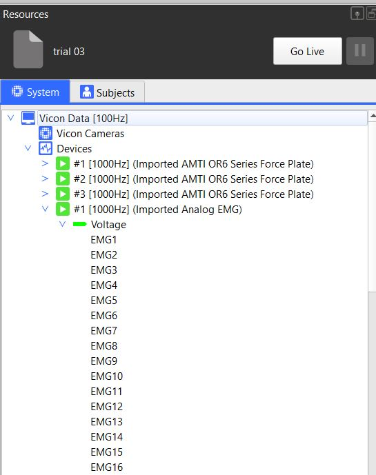


Before running any commands, be sure your virtual python environment is activated. Type `activate pycgm39`


Similarly to plot commands, emg commands propose convenient emg representation

To find out the different plot commands, type 
```bash
pycgm2.exe NEXUS Plots EMG -h
```


Except *temporal representation*, all commands require you previously identified gait events  


<div style="max-height: 800px; overflow-y: auto;">
<center>
<figure>

flowchart LR
  id0[load a gait trial with model outputs]

  id01[marked two gait trials \n in eclipse]

  id02[marked *n* gait trials \n in eclipse]

subgraph EMG
    
    subgraph emgSub[" "]
        id41[temporal representation]
        id411[pycgm2.exe NEXUS Plots EMG Temporal ]
        style id411 fill:#000000,stroke:#333,stroke-width:4px,color:#ffffff
        
        id42[Time-Normalized representation]
        id421[pycgm2.exe NEXUS Plots EMG Normalized ]
        style id421 fill:#000000,stroke:#333,stroke-width:4px,color:#ffffff
    end
    
    id43[Comparison]
    id431[pycgm2.exe NEXUS Plots EMG Comparison ]
    style id431 fill:#000000,stroke:#333,stroke-width:4px,color:#ffffff
  end


  
  id0--->emgSub
  id41--command---id411
  id42--command---id421
  id43--command---id431

  id01---> id43
  id02---> id42


</center>
</div> 


**To know input arguments** 
 * type `pycgm2.exe NEXUS Plots EMG Normalized -h ` 
 * Refer to the [documentation API](https://pycgm2.github.io/pyCGM2/Apps/nexus.html#EMG)


## Preliminary settings


EMG plot command failed if you have not labelled your analog channels as follow 





We predefined the location of 16 emg devices. 

| EMG channel   | Muscle            | Side    |
|:-------------:|:-----------------:|:-------:|
| EMG1          | rectus femoris    | Left    |
| EMG2          | rectus femoris    | Right   |
| EMG3          | vastus lateralis  | Left    |
| EMG4          | vastus lateralis  | Right   |
| EMG5          | semitendinosus    | Left    |
| EMG6          | semitendinosus    | Right   |
| EMG7          | tibialis anterior | Left    |
| EMG8          | tibialis anterior | Right   |
| EMG9          | soleus            | Left    |
| EMG10         | soleus            | Right   |
| EMG11         | None              | None    |
| EMG12         | None              | None    |
| EMG13         | None              | None    |
| EMG14         | None              | None    |
| EMG15         | None              | None    |
| EMG16         | None              | None    |


 Consult the [how to]()  page if you want to modify this configuration. 



