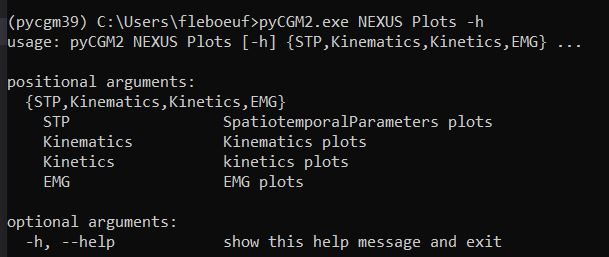


Before running any commands, be sure your virtual python environment is activated. Type `activate pycgm39`


To find out the different plot commands, type 
```bash
pycgm2.exe NEXUS Plots -h
```




This flowchart describes the different scenario and available plot commands. 
For instances, you can plot time normalized kinematic either after loading your trial into nexus or marked serveral trials in the vicon eclipse data manager. The comparison plot only traces data from 2 eclipse-marked trials.  


except *temporal representation*, all commands require you previously identified gait events  



<div style="max-height: 800px; overflow-y: auto;">
<center>
<figure>

flowchart LR
  id0[load a gait trial with model outputs]

  id01[marked two gait trials \n in eclipse]

  id02[marked *n* gait trials \n in eclipse]

  subgraph SpatioTemporal
    id1[pycgm2.exe NEXUS Plots STP ]
    style id1 fill:#000000,stroke:#333,stroke-width:4px,color:#ffffff
  end

  subgraph MouvementAmbulationProfile
    id11[pycgm2.exe NEXUS Plots MAP ]
    style id11 fill:#000000,stroke:#333,stroke-width:4px,color:#ffffff
  end

  subgraph Kinematics

    subgraph kinematicSub[" "]
        id21[temporal representation]
        id211[pycgm2.exe NEXUS Plots Kinematics Temporal ]
        style id211 fill:#000000,stroke:#333,stroke-width:4px,color:#ffffff
        
        id22[Time-Normalized representation]
        id221[pycgm2.exe NEXUS Plots Kinematics Normalized ]
        style id221 fill:#000000,stroke:#333,stroke-width:4px,color:#ffffff
    end

    id23[Comparison]
    id231[pycgm2.exe NEXUS Plots Kinematics Comparison ]
    style id231 fill:#000000,stroke:#333,stroke-width:4px,color:#ffffff
  end
 


subgraph Kinetics

    subgraph kineticSub[" "]
        id31[temporal representation]
        id311[pycgm2.exe NEXUS Plots Kinetics Temporal ]
        style id311 fill:#000000,stroke:#333,stroke-width:4px,color:#ffffff
        
        id32[Time-Normalized representation]
        id321[pycgm2.exe NEXUS Plots Kinetics Normalized ]
        style id321 fill:#000000,stroke:#333,stroke-width:4px,color:#ffffff
    end
    
    id33[Comparison]
    id331[pycgm2.exe NEXUS Plots Kinetics Comparison ]
    style id331 fill:#000000,stroke:#333,stroke-width:4px,color:#ffffff
  end

subgraph Reaction
    
    subgraph reactionSub[" "]
        id41[temporal representation]
        id411[pycgm2.exe NEXUS Plots Reaction Temporal ]
        style id411 fill:#000000,stroke:#333,stroke-width:4px,color:#ffffff
        
        id42[Time-Normalized representation]
        id421[pycgm2.exe NEXUS Plots Reaction Normalized ]
        style id421 fill:#000000,stroke:#333,stroke-width:4px,color:#ffffff
    end
    
    id43[Comparison]
    id431[pycgm2.exe NEXUS Plots Reaction Comparison ]
    style id431 fill:#000000,stroke:#333,stroke-width:4px,color:#ffffff
  end


  


  id0--->SpatioTemporal
  id0--->MouvementAmbulationProfile
  id0--->kinematicSub
  id0--->kineticSub
  id0--->reactionSub

  id21--command---id211
  id22--command---id221
  id23--command---id231

  id31--command---id311
  id32--command---id321
  id33--command---id331

  id41--command---id411
  id42--command---id421
  id43--command---id431


  id01---> id23
  id01---> id33
  id01---> id43

  id02---> id22
  id02---> id32
  id02---> id42

  linkStyle 0 stroke:#ff0000,stroke-width:2px;
  linkStyle 1 stroke:#ff0000,stroke-width:2px;    
  linkStyle 2 stroke:#ff0000,stroke-width:2px;
  linkStyle 3 stroke:#ff0000,stroke-width:2px;
  linkStyle 4 stroke:#ff0000,stroke-width:2px;

  
  linkStyle 14 stroke:#1900ff,stroke-width:2px;
  linkStyle 15 stroke:#1900ff,stroke-width:2px;
  linkStyle 16 stroke:#1900ff,stroke-width:2px; 


</center>
</div> 

**To know input arguments** 
 * type `pycgm2.exe NEXUS Plots Kinematics Normalized -h ` 
 * Refer to the [documentation API](https://pycgm2.github.io/pyCGM2/Apps/nexus.html#Plots)
 


