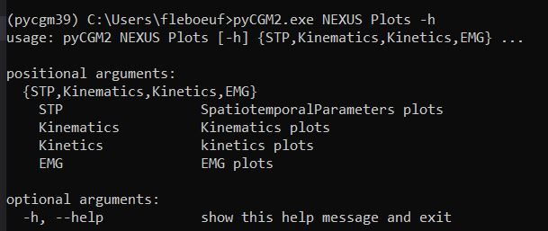
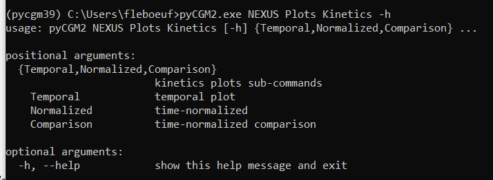
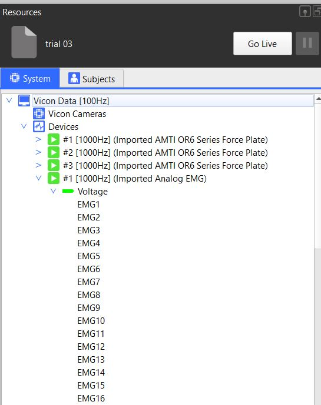

if you type `pycgm2.exe NEXUS Plots -h` in the  *miniconda console*, you will see that we propose
plot for : 
* the spatiotemporal parameters, 
* kinematics, 
* kinetics 
*  EMG

if you enter in the *kinetics* section with `pycgm2.exe NEXUS Plots Kinetics -h`, you will see, you can plot :
 * temporal plot
 * time-normalized variables
 * comparison of the time-normalized variables from 2 trials

The following sections dive into the different plotting options

## spatiotemporal plots


Spatiotemporal plot implies you previously identified gait events and the presence of the markers (L(R)HEE - L(RTOE))   -  


first, load your gait trial

then, run the command : `pycgm2.exe NEXUS Plots STP`

Type  `pycgm2.exe NEXUS Plots STP -h`  to know the input arguments. . Refer to the [argument reference]() page for details. 

## kinematics and kinetics plots


 kinematics and kinetics plots imply you previously identified gait events and fit a CGM on your gait trial 


first, load your gait trial

To plot kinematics, you can run one these commands 
 * `pycgm2.exe NEXUS Plots Kinematics Temporal`
 * `pycgm2.exe NEXUS Plots Kinematics Normalized`

Replace `Kinematics` with `Kinetics`  to plot kinetics

Add the `-h` to the command (e.g.  `pycgm2.exe NEXUS Kinematics Temporal -h`)   to know the input arguments. . Refer to the [argument reference]() page for details. 

### Kinematics and kinetic comparison of gait trials

First, mark in the vicon eclipse database, the trials you want to compare.

Then, run the `pycgm2.exe NEXUS Plots Kinematics Comparison` to render kinematic comparison panels for the left and right sides  

Replace `Kinematics` with `Kinetics`  to render kinetic comparison panels

Type  `pycgm2.exe NEXUS Plots Kinematics Comparison -h`  to know the input arguments. . Refer to the [argument reference]() page for details. 

### Kinematics Movement Analysis Profile (MAP)

first, load your gait trial

To plot the MAP histogram, you can run one these commands 
 * `pycgm2.exe NEXUS Plots Kinematics MAP`

## EMG plot

Like kinematics and kinetics, EMG plot commands propose to render : 
 * Temporal panels from trial loaded in Nexus : type `pycgm2.exe NEXUS Plots EMG Temporal` 
 * Time-normalized panels from trial loaded in Nexus, type  `pycgm2.exe NEXUS Plots EMG Normalized`
 * comparison of trials marked in the Nexus Eclipse database, type `pycgm2.exe NEXUS Plots EMG Comparison`  

This command will fail if your configuration does not match with our settings.

We configured emg settings for **16 emg channels**. 

In the nexus system panel, these channels are simply labelled : EMG1 to EMG16, as your can see here :

We predefined the position of each emg device. Please respect this configuration

| EMG channel   | Muscle            | Side    |
|:-------------:|:-----------------:|:-------:|
| EMG1          | rectus femoris    | Left    |
| EMG2          | rectus femoris    | Right   |
| EMG3          | vastus lateralis  | Left    |
| EMG4          | vastus lateralis  | Right   |
| EMG5          | semitendinosus    | Left    |
| EMG6          | semitendinosus    | Right   |
| EMG7          | tibialis anterior | Left    |
| EMG8          | tibialis anterior | Right   |
| EMG9          | soleus            | Left    |
| EMG10         | soleus            | Right   |


 Consult the [how to]()  page if you want to adapt this configuuration to your routine. 


