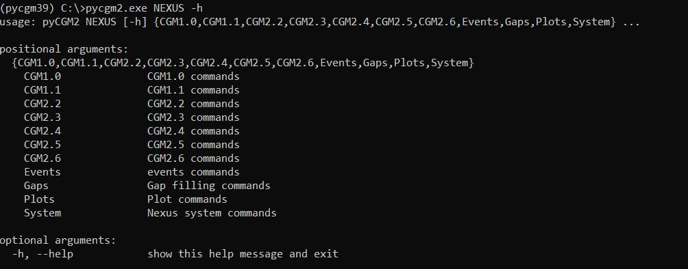

<p class="text-danger">This website only covers the use of the <b>release candidate pyCGM2 4.3-rc3</b>. 
please refer to Nexus documentation for the use of the Nexus-embedded pyCGM2 version</p>


Before running any commands, be sure your virtual python environment is activated . 
</br>
type `activate pycgm39`



## Quickstart

Check out this video, you will see how to calibrate a static trial, then fit a gait trial with the CGM1.0, and eventually plot the time-normalized kinematics.  



</br>

The subsequent steps presented on this video are:

1. open the anaconda prompt console and activate your environment
```bash
activate pycgm39
```
2. open Nexus, load you static file and apply the CGM1.0 calibration
```bash
pyCGM2.exe NEXUS CGM1.0 Calibration
```

3. load your gait trial, fit the CGM1.0 and plot time-normlaized kinematics
```bash
pyCGM2.exe NEXUS CGM1.0 Fitting
pyCGM2.exe NEXUS Plots Kinematics Normalized
```

## Commands


To explore all the commands available in pyCGM2 for Nexus interaction, simply enter the following in your command prompt:

```bash
pycgm2.exe NEXUS -h
```


This command lists the various operations you can perform with pyCGM2. Below is an overview of each command category:

 - **CGM #i:** Apply different Conventional Gait Models (CGM) for gait analysis. 
 - **Events:** Methods for automatically detecting gait events, such as foot strikes and offs
 - **gaps:** Techniques to fill missing data in your trial
 - **Plots:** Commands for easy data visualization, facilitating the interpretation of captured movements.
 - **System:**  Explore your Nexus hardware environment, providing insights into available configurations and devices for motion capture.