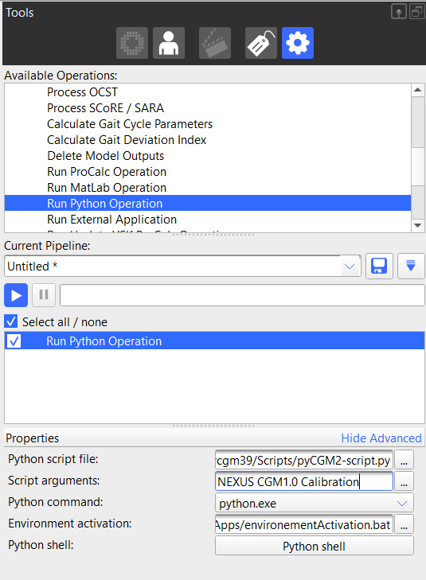

## Integrate an pyCGM2 command as operation of a nexus pipeline


Before running any commands, be sure your virtual python environment is activated. Type `activate pycgm39`


To integrate a pyCGM2 operation into a Vicon nexus pipeline, you need to insert a *run python operation* into your pipeline and configure it as follow :



 * switch to `advanced mode`
 * **the python script file** must target :  `CONDA_PATH/envs/pycgm39/Scripts/pyCGM2-script.py`
 * place the input arguments in the **script arguments** text box. 
 In this example, we want to calibrate our static trial with the CGM1.0
 * In **Environment activation**, you need to place the bat file that activate your virtual python environment -( here `pycgm39`).
   * create a new file named `environmentActivation.bat` and edit it with a text editor (e.g. notepad)
   * place into the file, the following content   
    ```bash
    @echo off
    
    rem Set the path to your Miniconda installation directory
    set "CONDA_PATH=C:\Users\fleboeuf\Miniconda3"
    
    rem Set the name of your virtual environment
    set "ENV_NAME=pycgm39"
    
    call "%CONDA_PATH%\Scripts\activate.bat" %ENV_NAME%
    ```
    * edit `CONDA_PATH`  and  the appropriate virtual environment name `ENV_NAME`
    * save your file. 

 
  if you do not know where is *CONDA_PATH*, open a conda console and type `conda info`


## Change default CGM settings temporarly


Default settings are configured in the folder: *CONDA_PATH/envs/ENV_NAME/Lib/site-packages/pyCGM2/Settings*

Both *calibration* and *fitting* commands (e.g `pycgm2.exe NEXUS CGM1.0 Calibration` and ( resp `pycgm2.exe NEXUS CGM1.0 Fitting`))) 
called default settings, you can alter with  [input arguments]()

An alternative is to place a CGM settings file (e.g [`CGM2_3-pyCGM2.settings` for the CGM2.3) l into the data folder. 
Do it manually or through a command : 

 * open a miniconda prompt
 * change your current directory to target the data folder
 * run the command `pycgm2.exe SETTINGS Edit -m CGM2.3` or `pycgm2.exe SETTINGS Edit --model CGM2.3` fro the CGM2.3

The command will place the `CGM2_3-pyCGM2.settings` file into your data folder so you can amend it. 

For instance, you can disable the flat foot options in the calibration section

```yaml
Calibration:
    HJC:
        Left: Hara #[string](choice: Hara only)
        Right: Hara
    Left flat foot: 0 #[integer](choice: 0 or 1)
    Right flat foot: 0
    Head flat : 0
```


  You can also **permanantly** alter the default CGM settings. 
  </br>
  Find and ammend the `CGM2_3-pyCGM2.settings` 
 


## Modify the default EMG configuration

Default EMG settings are configured in the file: *CONDA_PATH/envs/ENV_NAME/Lib/site-packages/pyCGM2/Settings/emg.settings*

We predefined the location of 16 emg devices as follow

| EMG channel   | Muscle            | Side    |
|:-------------:|:-----------------:|:-------:|
| EMG1          | rectus femoris    | Left    |
| EMG2          | rectus femoris    | Right   |
| EMG3          | vastus lateralis  | Left    |
| EMG4          | vastus lateralis  | Right   |
| EMG5          | semitendinosus    | Left    |
| EMG6          | semitendinosus    | Right   |
| EMG7          | tibialis anterior | Left    |
| EMG8          | tibialis anterior | Right   |
| EMG9          | soleus            | Left    |
| EMG10         | soleus            | Right   |
| EMG11         | None              | None    |
| EMG12         | None              | None    |
| EMG13         | None              | None    |
| EMG14         | None              | None    |
| EMG15         | None              | None    |
| EMG16         | None              | None    |  

If your session does not match with this configuration, you can place the  `emg.settings` file into your data folder, then amend it.

Do it manually or through the command
 * open a miniconda prompt
 * change your current directory to target the data folder
 * run the command `pycgm2.exe SETTINGS Edit -e ` or `pycgm2.exe SETTINGS Edit --emg `


For instance, if your emg 1 and 2 are placed on the gluteus medius rather than the rectus femoris, open the `emg.settings` and edit the section

```yaml
CHANNELS:
    Voltage.EMG1 :
        Muscle : GLUMED 
        Context : Left 
        NormalActivity : GLUMED 

    Voltage.EMG2 :
        Muscle : GLUMED
        Context : Right
        NormalActivity : GLUMED
```



  You can also **permanantly** alter the emg settings. 
  </br>
  Find and ammend the `emg.settings` file
 


