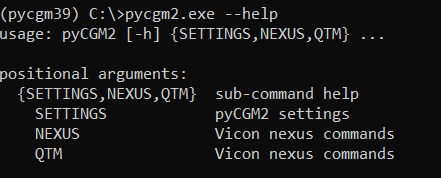

Please note that this documentation pertains exclusively to the <strong>release candidate of pyCGM2 version 4.3-rc3</strong>. This specific release has not undergone internal testing by the developers at Vicon and Qualisys.

<strong>Important:</strong> This resource focuses solely on the command-line usage of pyCGM2, excluding interactions through graphical user interfaces. For applications involving Nexus or QTM integration, please consult the respective official documentation.

## Getting start

The interaction with Nexus and QTM were heavily improved from **pyCGM2 Version 4.3.0**

A single and more explicit command `pyCGM2.exe` rulls out all the package 


  type `pyCGM2.exe -h` or `pyCGM2.exe --help` to dive it the different commands 


the `pyCGM2.exe` is composed of 3 subcommands : 
 * SETTINGS
 * NEXUS 
 * QTM  

that you can explore with `pyCGM2.exe NEXUS -h` or `pyCGM2.exe QTM -h`. 

check out the next pages to find out how to work with NEXUS and QTM commands

  

