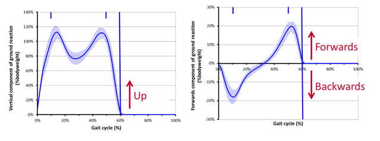
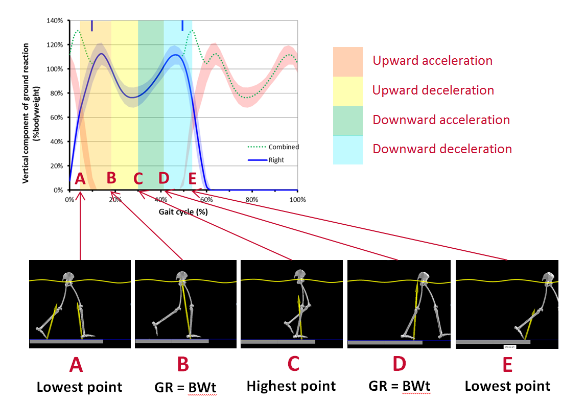
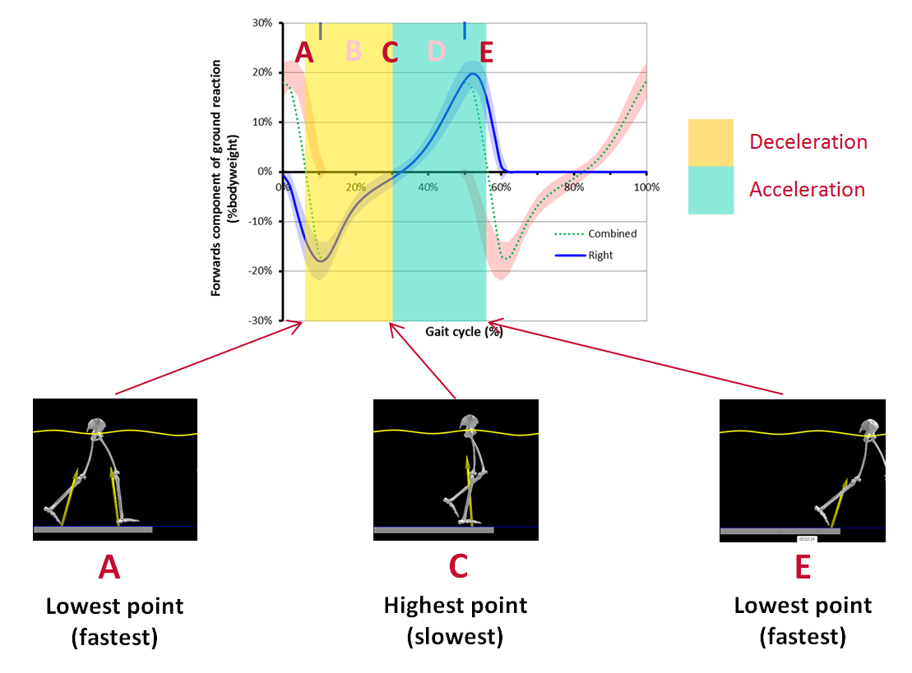
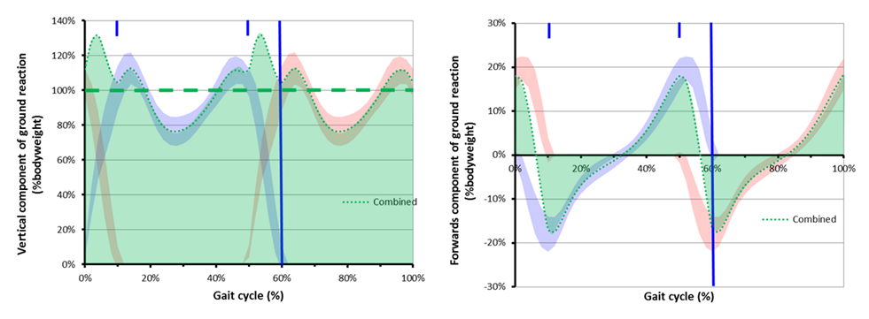
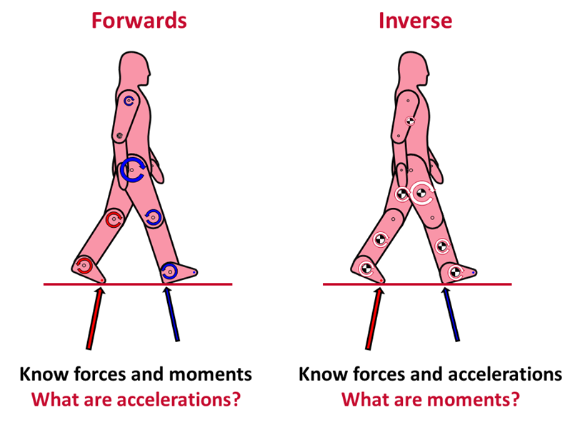
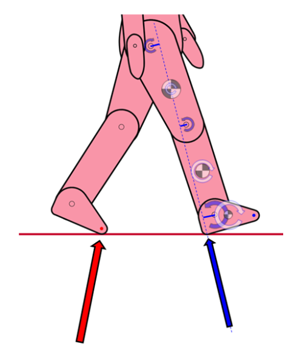
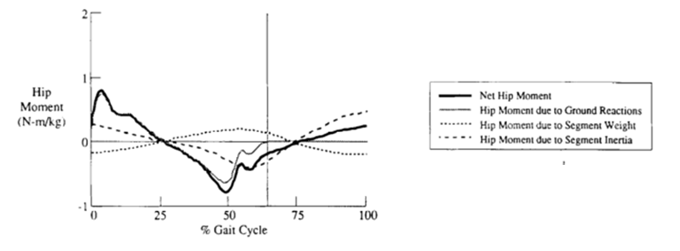
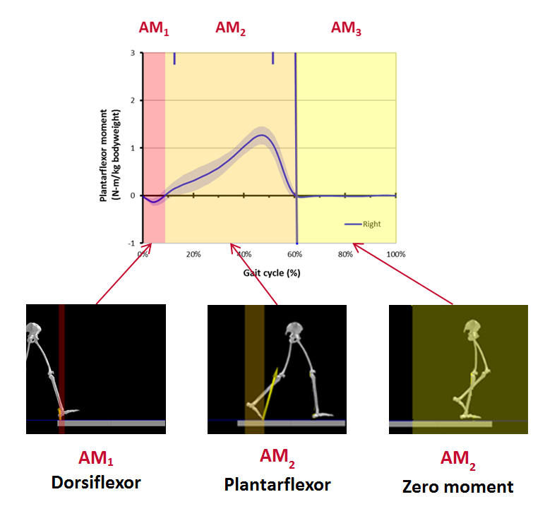
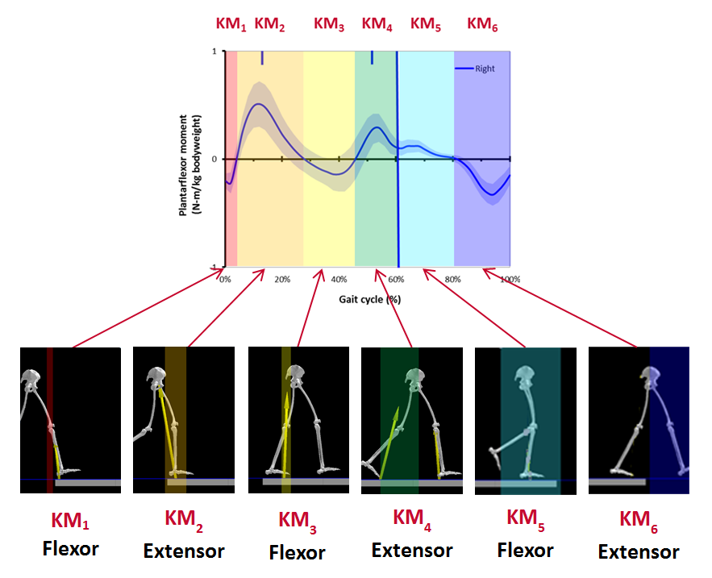
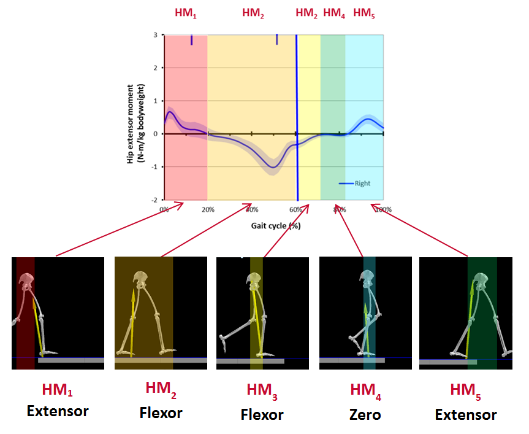

## Why we walk the way we do : Kinematics

| link     |     Details   |
|----------|---------------|
|||
| [Part 1](https://www.youtube.com/watch?v=iG6KfzoqWyg) |  The first screencast in the series explaining the biomechanics of normal walking. Subsequent screencasts can be viewed by clicking on the link at the end of this one or directly using the links below.This screencast establishes an historical context for the approach I’ve adopted |
| [Part 2](http://www.youtube.com/watch?v=i5jaeqCg26Q) | This is meant as a short introduction for people not used to the idea of biomechanical models. Best skipped if you do! |
| [Part 3](http://www.youtube.com/watch?v=zWss9pFhAHc) | A little similar to the previous screencast in that it’s really for people who aren;t familiar with great graphs and will be of little use to those who are. |
| [Part 4](http://www.youtube.com/watch?v=hDt6QsErrX8) |Energy|
| [Part 5](http://www.youtube.com/watch?v=2riFtUAGsY8) |Clearance|
| [Part 6](http://www.youtube.com/watch?v=1EYnQ7kwY5Y) |Step length|
| [Part 7](http://www.youtube.com/watch?v=mYC3w1vzgJo) |Support|
| [Part 8](http://youtu.be/Ix48KK4SR3M) |Transitions|

## Why we walk the way we do: Kinetics

Kinematics deals with what we can see. Kinetics deals with forces and moments, things we cannot see. By their very nature therefore kinetics are less intuitive than kinematics – in fact it can be argued that they are not intuitive at all. In order to understand kinetics therefore we must invest some time learning some basic principles before trying to apply these to walking.

Some people have argued that kinetics in some sense explain the kinematics. This is not really true. Kinetics are measurements of what is happening at a particular time just as much as kinematics. They are simply another set of observations that lead us to a more complete description of that gait. If we really want to know why a patient is walking in a particular way then we would have to do experiments – to see how that walking pattern changed in different circumstances. Having said this we cannot truly say that we understand walking if we don’t understand the kinetics as well as the kinematics.

Conventional clinical gait analysis has dealt with joint angles and with joint moments and powers. The concept that links the two together however is often missed off the traces that our systems print out for us – it is the ground reaction (note that a reaction is another word for a force so there is no need to say ground reaction force). This is the force exerted by the floor on the foot.

## Forces in General

#### Force and acceleration

The action of a force is to change the speed at which something is moving. Thus if we apply a force to a stationary object it will start to move. If it is already moving it will either mover faster if we push in the direction in which it is moving (we call this acceleration) or move slower if we push against the direction of movement (deceleration). The same force can lead to an acceleration if it is pushing the object in the direction it is already moving in, or deceleration if it is moving in the opposite direction. If the speed changes by the same amount then the force required will be the same. Thus it takes the same force to accelerate an object from 3m/s to 5 m/s as it does to decelerate it from 7m/s to 5m/s or from 2m/s to a dead stop (over the same time interval).

Perhaps the most forgotten about physical principle in gait analysis is that in the absence of any force an object simply keeps moving. When walking at steady speed we do not need to look for a source of propulsion because in the absence of any force the body will simply continue moving at a constant speed . If the body does require to be propelled forward at some stage in the gait cycle it must be because its progress is being opposed by a force being applied at some other part in the gait cycle. Particularly when considering pathological gait will almost always be more enlightening to identify the force that is opposing movement than the source of the propulsive force which is a response to this.

The force required to change the speed at which an object is moving is also proportional to the mass of the object – the heavier the object the larger the force – and inversely proportional to the time interval – the shorter the time interval the larger the force.

#### Components of force

Like any force it needs to be thought about in three dimensions and is commonly represented by an arrow. The length of the arrow is proportional to the size of the force – the longer the arrow the bigger the force. The direction in which the arrow is pointing is also important – a force pointing upwards has a very different effect to a force pointing anteriorly. A little later we will start to consider moments and then we will see that the position of the arrow is also important. Two forces of the same magnitude acting in the same direction can generate very different moments at a joint.

Although force act in three dimensions we are very often able to simplify things by considering the effects of a force in a particular direction at a particular time. To do this we need to grasp the very simple concept of the component of a force. The solid black line in the figure represents a force acting forwards and upwards. The effect of travelling along the horizontal grey arrow and then up the vertical grey arrow can be seen as the same as the overall effect as travelling along the black arrow. These are the horizontal (Fhor) and vertical (Fver ) components of the force. Most of the time we can think about these completely separately to each other when considering the action of the force.

#### Gravity

The statement above that the action of a force is to change the speed at which something is moving refers to the total force acting on the object. For all objects in a gravitational field this must include the force due to gravity. This is proportional to the mass of the object – the heavier the object the greater the force due to gravity. Gravity always acts vertically and this is where the concept of components of a force really comes in useful. If we want to know how an object is going to accelerate in the horizontal direction then all we need do is measure (or calculate) the component of force that we apply in that direction. If we want to know how an object is going to accelerate or decelerate in a vertical direction then we need to measure the component of the force that we apply in an upwards direction and subtract the force due to gravity. If the upwards force is greater than gravity then the acceleration will be upwards. If the object is already moving upward then it will move upwards at a faster speed. If it is moving downwards then it will move downwards at a slower speed. If gravity is larger then the opposite will occur.

## The Ground Reaction

As stated above the ground reaction is the force exerted on the foot by the ground. The ground can’t pull down on the foot in any way so the vertical component of this force must be directed upwards. As there is friction between the foot and the ground, however, it is possible for the horizontal and components (in the fore-aft or medio-lateral directions) to be either positive or negative.

Each of these components can be plotted on a gait graph in exactly the same way as any other gait data can be plotted.

  Vertical (left) and horizontal (right) components of the ground reaction plotted as gait graphs.

The ground reaction is the total force exerted by the ground on the foot and can be considered to be composed of a number of different forces acting on the different areas of the sole of the foot. The position at which it is located is called the centre of pressure. This can be considered as a sort of average position of the force and must be within the area of contact of the foot with the floor.

## What the ground reaction looks like in normal walking – vertical component

The vertical component of the ground reaction in normal walking has a characteristic “double bump” pattern. To understand why it is this shape we need to compare it with the trajectory of the body centre of mass (CM, the yellow line in the figure below) that we discussed in terms of kinematics yesterday. As we learnt then this is moves up and down along a smooth path twice during the gait cycle. It is at its lowest twice (approximately in the middle of the two double support periods) and at its highest twice (approximately at the middle of stance for both limbs, and hence in the middle of swing as well). The forces causing any periodic motion such as this will have four phases.

In order to see the correspondence between the ground reaction and the trajectory of the centre of mass, however, it is important to consider the total ground reaction, not just that occurring under one foot or the other. In the diagrams her the ground reaction under the right leg is plotted in blue and the total ground reaction (right and left combined) is represented by the green dotted line.
Variation of the vertical component of the ground reaction throughout the gait cycle

Variation of the vertical component of the ground reaction throughout the gait cycle

## Upwards acceleration phase

At point A, approximately in the middle of double support, the body is at its lowest (see figure above). At this instant in time the centre of mass is travelling horizontally (without any component of speed in the vertical direction). For the inverted pendulum mechanism to take over in single support then the body has to be accelerated upwards. In order for this to happen the combined ground reaction must be greater than bodyweight. This is a combination of the increasing force under the right limb and the decreasing force under the left limb. You can see that the green trace representing the combined force is above bodyweight throughout double support. This phase will continue through opposite foot off, by which time the force under the right leg is well over bodyweight, until that force drops below body weight at point B.

During the time interval between A and B, therefore, the centre of mass is being accelerated upwards by the ground reaction. This is quite different from many explanations of the ground reaction which associate this phase with shock absorption. This must be wrong because shock absorption is always associated with a deceleration of a mass.

#### Upwards deceleration phase

Once the ground reaction has dropped below gravity then the centre of mass will experience a total downwards force. Given that it is already travelling upwards this will cause the body to decelerate. The upwards component of velocity will thus reduce until, at its highest point (Point C) the centre of mass is travelling horizontally (the vertical component of velocity is zero).
Downwards acceleration phase

After this point gravity is still greater than the ground reaction so the total force is still acting downwards. The downwards velocity of the centre of mass velocity will thus increase – it will decelerate downwards. This will continue until the ground reaction increases once more to a value above bodyweight at point D in late single support.

#### Downwards deceleration phase

Once the ground reaction is greater than bodyweight then the total force is upwards. As the centre of mass is travelling downwards at this point this will lead to a reduction (deceleration) of this downwards movement. If we consider the force under just one limb it looks as if this falls below bodyweight just after opposite foot contact but increasing force under the other limb maintains the total ground reaction above bodyweight until about mid-way through double support. By this time the downward movement has stopped, the centre of mass is moving horizontally through its lowest point (E) and the same sequence of four phases occurs under the other limb. Point E for one limb is the equivalent of point A for the other.

As with the first phase this last phase is generally not well described in the literature. There is a tendency to refer to this phase as push-off from which some people infer that the body is being accelerated upwards, that its upwards speed is increasing. The opposite is actually happening, the downward speed is decreasing.

### What the ground reaction looks like in normal walking – horizontal component

The main features of the fore-aft component of the ground reaction are a little easier to understand and can be understood in terms of just two phases. Again to relate these to the centre of mass movement we need to think about how the combination of the force under both legs is acting, this is again represented by the dotted green line in the graphs. Gravity does not act in the horizontal direction so all we need think about is the magnitude and direction of the two ground reactions.
Variation of the horizontal component of the ground reaction throughout the gait cycle

Variation of the horizontal component of the ground reaction throughout the gait cycle

#### Deceleration phase

Although the horizontal velocity of the centre of mass varies throughout the gait cycle it always moves forwards so we don’t need to worry about which direction it is accelerating in. To conserve energy it must have maximum kinetic energy (be moving fastest) when it has minimum potential energy. As discussed in the section above this occurs at the point A close to the middle of first double support.

From this point until the centre of mass is at its highest in approximately the middle of stance (point C) the body will be gaining potential energy and we therefore expect its kinetic energy to reduce. The centre of mass experiences a deceleration which must be the consequence of a backwards directed force. If just consider the force under one limb we might assume that this starts at foot contact. If we consider the force acting under both limbs, however, it is quite clear that the total force only becomes backwards in the middle of first double support (point A).

#### Acceleration phase

The reverse happens as the body moves from point C where the centre of mass is highest to the middle of second double support when the body is once again at its lowest. As potential energy is lost this is converted into kinetic energy and the body accelerates. If this is happening then there must be a forwards directing force acting on the body. Again this only extends to mid-way through second double support rather than through to toe off because of the force arising under the other leg.

One of the interesting features of the fore-aft component of the ground reaction is that it is predicted almost exactly by the mechanics of the inverted pendulum (this is not true of the vertical component). The force arises largely because of the alignment of the body parts and the requirement of the muscles is for them to maintain that alignment rather than to actively generate a braking or push-off force.

It is worth noting that the phases for vertical and horizontal components of the ground reaction are essentially reversed in early and late stance. In early stance the vertical component acts to accelerate the body upwards whereas the horizontal component acts to decelerate it in in a forwards direction. In late stance the vertical component is acting to decelerate that downwards velocity whereas the horizontal component acts to accelerate it in a forward direction.

## Properties of the components of the ground reaction for cyclic walking

There are certain properties of the ground reaction that follow directly if the walking pattern is cyclic. The average vertical of both components of the ground reaction must be equal to bodyweight and the average of the horizontal components must be equal to zero (see Figure below).
Figure illustrating properties of ground reaction for cyclic walking. The total vertical component must average bodyweight over the gait cycle and the hoizotnal component must average zero

Figure illustrating properties of ground reaction for cyclic walking. The total vertical component must average bodyweight over the gait cycle and the hoizotnal component must average zero

## Moments in biomechanics

A force acts to accelerate a body in a particular direction. In many ways moments are similar except that they act to cause a rotational acceleration about a particular pivot or hinge. A rotational acceleration is simply a change in the speed something rotates (its angular velocity). It the moment is in the same sense as the movement then the object will rotate faster (angular acceleration) if it is in the opposite sense then the object will rotate slower (angular deceleration). If not moment is applied then the object will continue to rotate at constant speed.

When we apply a force to an object we almost always apply a moment at the same time (and almost all moments we come across in biomechanics are the result of the application of a force). To fully understand how that object will accelerate we need to consider the effect of both the force and the moment. The moment of a force is the product of its magnitude and the perpendicular distance between its line of action and the axis about which the moment is being calculated. It is easier to draw the perpendicular distance than to explain it.

Once we have calculated the force and moments for a simple object then we can predict how it will move (accelerate). Unfortunately in biomechanics we are very rarely dealing with simple objects. We are almost always considering systems of objects (body segments often related to particular bones) linked by joints. In principle, if we understand the inertial properties of the segments and the movement that is possible at each of the joints and we know all the forces and moments acting on and within the system then we should be able to predict how the whole system will move (accelerate). This is called forwards dynamics. Unfortunately this is extremely difficult and can currently only be implemented by complex computer programmes which have only been used in a quite limited number of applications.

More practically, if we know the external forces and moments acting on the system, its inertial properties and how the system is accelerating at any given time we can calculate what forces and moments must be acting internally at the joints. This is called inverse dynamics. It is useful because it tells us which muscle groups are dominant at a particular joint. It is worth noting that this is all it tells us. Inverse dynamics cannot predict how the body will move, it can only tell us which muscle groups must dominate in cause the movement that you have already measured. Thus just because the knee extensors are shown to be dominant does not mean that the knee will extend. Whether it extends or not will depend on the moments at all the other joints and the ground reaction forces that are acting at any particular time. If you think about it eccentric activity would not be possible if this were not the case. Take the example of early stance. We calculate a large moment in the knee extensors but the knee accelerates into more flexion because of the action of moments at other joint s and the ground reaction.

## Calculating joint moment

The most important forces acting on the body during walking are the ground reactions under each foot. Inverse dynamic calculations to estimate muscle activity are based on a calculation of the moment exerted by the ground reaction modified by terms to reflect the effects of gravity and any accelerations that are occurring (also known as the inertial terms). This gives the externally applied moment which must be resisted by the muscle moment (and that of any other soft tissues crossing the joint).

 Direct effect of the ground reaction at the ankle, knee and hip 

To calculate the moment exerted by the ground reaction at a particular joint we need to know the magnitude of the force (as discussed earlier) but we also need to know the point through which it is acting. This is called the centre of pressure. All force plates used in biomechanics measure the coordinates of this point as well as the components of the force itself. We also need to know the position of the joint about which we are making measurements. This comes from the kinematic analysis. It is then relatively easy for the computer to calculate the perpendicular distance from the line of action of the force to the joint centre and multiply this by the magnitude of the ground reaction.

 Relative contributions of different ground reaction, gravity (weight) and acceleration (inertia) to the hip joint moment [1]  

From this we need to subtract the effects of gravity on the segments distal to the joint and of any acceleration of these segments (also known as inertial effects). (This is also done by the computer and there is little need to discuss exactly how this is done). These additional terms depend on the mass of the segments distal to the joint being considered. For the knee and more distal joints the mass of these segments is so small that they can be ignored in comparison to the much larger moment exerted by the ground reaction. In normal walking the effects of gravity and accelerations at the hip tend to cancel each other out so the direct effect of the ground reaction is also quite a good approximation to the muscle moment. It should be noted that this cannot be assumed in abnormal gaits and particularly if walking speed is reduced in which case acceleration effects are likely to be reduced much more than gravitational effects.

## What the moments look like in normal walking?

Once we understand why the body moves the way it does (as we discovered in “Why we walk the way we do”) and we understand how the ground reactions are responsible for causing accelerations required for the centre of mass to move along its required trajectory (as we’ve learnt in the earlier part of this lecture). Then the we can understand why the joint moments measured during normal walking take on their characteristic patterns. We’ll limit our discussion here to the sagittal plane where most of the action takes place.

#### Ankle moment

The first part of the foot to make contact with the ground is the heel and thus the centre of pressure must start off under the heel. The last point to be in contact with the ground is the toe so it must end up under the heel. In between it progresses from one to the other. At the instant of foot contact the centre of pressure is so far back that the ground reaction passes behind the heel. The effect of the ground reaction is thus to plantarflex the ankle giving rise to an internal dorsiflexion moment. This doesn’t last for very long however. The centre of pressure moves forwards very quickly and the ground reaction acts to dorsiflex the foot giving rise to an internal plantarflexion moment. This continues to grow as the centre of pressure moves forward which is why the moment its characteristic shape of continuing increase throughout stance until it finally start to reduce as the ground reaction diminishes in magnitude through second double support. It should be noted that the increasing moment arm of the force is the dominant feature in determining the shape of this moment. The much smaller fluctuations in the direction and magnitude of the ground reaction have much smaller effects.

  Variation in platarflexor moment throughout the gait cycle  

Obviously there is no ground reaction during swing to exert a moment. The mass of the foot is so small that the gravity and acceleration effects are too small to notice. Noticeable swing phase ankle moments are almost always an indicator of measurement error of some kind.

#### Knee moment

As discussed in the earlier lecture adequate step length is attained by having the hip flexed and the knee reasonably well extended just prior to initial contact. At foot contact the foot is thus in front of the knee and the ground reaction thus passes in front of the knee requiring an internal knee flexor moment to resist this. To achieve a smooth transition however the knee has started flexing in very late swing and continues flexing in early stance to allow the body to move over the planted foot without being force upwards. That knee flexion brings the knee in front of the ground reaction about half-way through first single support giving rise to an internal knee extensor moment. This reaches a peak at about the time of maximum stance phase knee flexion.

 Variation in knee extensor moment across the gait cycle

As the inverted pendulum mechanism takes over in single support the knee begins to extend and its forward velocity reduces. The centre of pressure moves forwards faster than the knee reducing the moment arm over which the ground reaction is acting. In most people the ground reaction actually passes in front of the knee leading to an internal knee extensor moment in middle and late single support. After this the knee starts flexing quite rapidly in preparation for toe off and the knee moves in front of the ground reaction requiring an internal knee extensor moment to prevent the knee flexing too much.

The mass of the tibia segment is quite a bit larger than that of the foot and joint moments arise during swing as a result of the gravity and inertia terms. In early swing the gravity is acting to extend the knee but not as much as is required to initiate the forward acceleration of the tibia so an internal knee extension moment is also required. In late swing it is necessary to decelerate the forward movement of the tibia and initiate knee flexion which require activity of the knee flexors which will be assisted in this by the action of gravity.

#### Hip moment

The characteristics of the hip moment curve are much simpler than those of the knee moment. Essentially there is an internal hip extensor moment in early stance and a hip flexor moment in late stance. (The relative of these magnitudes tends to vary between different centres even when they are using the same protocol and this has never been properly explained). Essentially the hip is behind the foot in early stance so the ground reaction tends to pass in front of the hip. As the body moved forwards over the planted foot the hip moves forwards until in late stance it is in front to the foot and the ground reaction tends to pass behind the foot.

 Variation in hip extensor moment throughout gait cycle 

In many ways the interesting thing about the hip moments is that they are not bigger. Two factors keep the size of the moment low (and thus reduce the demand on the musculature). The first is the progression of the centre of pressure under the foot throughout stance. In early stance when the hip is behind the foot the centre of pressure is at the rear of the foot thus minimising this distance. In late stance when the hip is in front of the foot the centre of pressure is at the front of the foot minimising this distance. The other factor is the alignment of the ground reaction which is largely a consequence of its horizontal component. In early stance the horizontal component is backwards which means the overall reaction distance that the reaction is in front of the hip is reduced. In late stance the horizontal component is forwards which reduces the distance that the reaction is behind the hip is reduced.

In early swing a hip flexor moment is required to accelerate the thigh and tibia forwards. In late swing a hip extensor moment is required to slow the limb down. Not that this requires after the femur has stopped flexing and must therefore be required to slow down the acceleration of the tibia not that of the femur.

### Sagittal plane moment summary

In summary:

* The simple shape of the sagittal plane ankle moment owes its shape to the way the centre of pressure moves forward under the foot through stance.
* The more complex shape of the knee moment arises because of fluctuations of the speed with which the knee joint moves forwards in comparison to the more constant forwards progression of the centre of mass.
* The simple shape of the hip moment is primarily determined by the position of the hip in relation to the foot.

### References

1. Ounpuu, O., R. Davis, and P. Deluca, Joint kinetics: Methods, interpretation and treatment decision-making in children with cerebral palsy and myelomeningocele. Gait and Posture, 1996. 4: p. 62-78.
