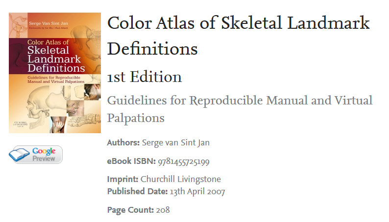
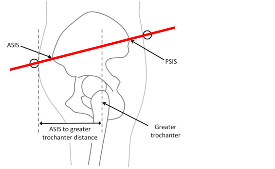

Find out more explanation of marker palpation in this book [**Color Atlas of Skeletal Landmark Definitions**](https://www.elsevier.com/books/color-atlas-of-skeletal-landmark-definitions/van-sint-jan/978-0-443-10315-5)

### LOWER BODY MARKERS

#### PSIS

> The PSIS is the most prominent posterior aspect of the iliac crest

**Palpation**

* Stand behind the participant and find the iliac crest laterally
* Move your thumbs in and down until you find a prominent bony bump (which sharply disappears distally)

or

* Look for the two dimples on the lower back – the PSIS are mostly located under the dimples (but not always)

**Marker placement**

* Place the centre of the marker over the most prominent aspect of the PSIS (both from superior to inferior and medial to lateral)
 * Take care to ensure that the centre of the marker lies within the plane of the pelvis (the plane linking the PSIS and ASIS markers – shown on the picture below)

#### ASIS

> The ASIS is the most prominent aspect of the iliac crest anteriorly

**Palpation**

* Stand next to the participant with your fingers on the anterior part of the iliac crest – move your fingers anteriorly and distally to follow the iliac crest forwards
* At the end of the iliac crest anteriorly there is a bony prominence which suddenly dips away distally – this is the ASIS

**Marker placement**

* Place the marker so that the centre lies over the most prominent area of the ASIS both mediolaterally and superior/inferiorly
* Take care to ensure that the centre of the marker lies within the plane of the pelvis

#### THI (lateral thigh)

##### Wand

**Marker placement**

* Place wand half way down lateral thigh in such a way that it and the hip joint and knee marker lie in the coronal plane of the femur which is defined as that containing the hip and knee joint centres and the lateral femoral epicondyle

#### Marker

**Marker placement**

* Place marker half way down lateral thigh (but not on the baseplate of the wand)
(Use the ASIS marker and the epicondyle markers to define the length of the femur in this instance)

#### THAP

**Marker placement**

* Place the marker one-third of the way down the centre of the anterior thigh
(Use the ASIS marker and the epicondyle markers to define the length of the femur in this instance)

#### THAD

**Marker placement**

* Place the marker two-thirds of the way down the centre of the anterior thigh
(Use the ASIS marker and the epicondyle markers to define the length of the femur in this instance)

#### KNE

> The lateral epicondyle of the femur is located on the lateral femoral condyle (above the knee joint line)

**Palpation**

* The participant should stand with knees in a neutral position (not hyperextended)
* Kneel in front of the participant and locate the joint line using the posterior crease of the knee
* Move a finger width above the knee joint line and palpate the lateral knee from front to back – the lateral epicondyle is a small lateral prominence slightly further back than the centre of the femoral condyle

or

* Place the participants foot on your knee so that their knee is flexed. Locate the joint gap of the knee and move your finger backwards and upwards until you reach the lateral epicondyle

or

* With the participant in standing, locate the fibula head. From the centre of the superior aspect of the fibula head move your fingers upwards to cross the joint line. Move your fingers forwards by approximately one finger width to locate the lateral epicondyle

**Marker placement**

* Place the centre of the marker over the most prominent aspect of the lateral epicondyle

#### KNM

> The medial epicondyle of the femur is located on the medial femoral condyle (above the knee joint line)

**Palpation**

* The participant should be standing with knees in a neutral position (knee not hyperextended)
* Kneel in front of the participant and place your fingers along the most distal third of the medial femur Follow the femur distally until a sharp bony prominence is felt – this is the adductor tubercle
* Move approximately the distance of a thumb width distally and half a thumb width anteriorly to palpate a small bony prominence – this is the medial epicondyle

or

* Place the participants foot on your knee so that their knee is flexed to 90 degrees
* Locate the adductor tubercle and move horizontally forwards to the most anterior point of the medial femoral condyle in this position (see below)
* The medial epicondyle is midway between these points

**Marker placement**

* Place the marker over the most prominent aspect of the medial epicondyle

**Check knee marker position via a small knee bend**

#### TIB

##### Wand

**Marker placement**

 * Place wand half way down the lateral lower leg in such a way that it and the knee and ankle joint centres lie in the coronal plane of the tibia

#### Marker

**Marker placement**

* Place marker half way down the lateral lower leg
* (Use the femoral epicondyle and malleoli markers to define the length of the tibia in this instance)

#### TIAP

> The tibial tubercle is the prominence on the superior anterior tibia (below the knee joint line)

**Marker placement**

* Place the marker 2cm distal to the most prominent aspect of the tibial tubercle

#### TIAD

**Marker placement**

* Place the marker half way down the lower leg on the crest (palpable ‘shin’) of the tibia

#### ANK

> The lateral malleolus is the distal end of the fibula, located on the lateral ankle

**Palpation**

 * Kneel in front of the participant and locate the distal end of the fibula
 * Find the anterior, posterior and inferior borders

**Marker placement**

 * Place the marker so that the distal tip of the baseplate lines up with the most distal aspect of the malleolus
 * The baseplate should be placed in the centre of the bone from anterior to posterior

#### MED

> The medial malleolus is the distal end of the tibia, located on the medial ankle

**Palpation**

 * Kneel in front of the participant and locate the distal end of the tibia medially
 * Find the anterior, posterior and inferior borders

**Marker placement**

 * Place the marker so that the distal tip of the baseplate lines up with the most distal aspect of the malleolus
 * The baseplate should be placed so that it is in the centre of the bone from anterior to posterior

### Foot markers

#### HEE

> The calcaneus is the heel bone

**Palpation**

 * Use a set square flush against the floor and aligned with the posterior heel to identify the most posterior prominent aspect of the calcaneus
 * Move medially and laterally to find the lateral edges at this point
 * Find the midpoint of these points

**Marker placement**

 * Place the top of the baseplate so that it is over the most prominent aspect of the posterior calcaneus

#### TOE (2nd metatarso-cuneiform joint)

> The second metatarsal is next to the metatarsal of the hallux. The metatarso-cuneiform joint is the joint between the proximal metatarsal and the bone proximal to this (the middle cuneiform)

**Palpation**

 * Find the distal end of the second metatarsal (end closest to the toes)
 * Follow the bone proximally to its proximal end and palpate the joint line between it and the proximal bone (the middle cuneiform)

If this is difficult you can try the following:

 * Palpate the second metatarsal as proximal as possible – use a ruler to draw the trajectory of a dotted line up the centre of the bone to the midfoot
 * Palpate the 1st metatarsal and find the joint line with the medial cuneiform (1st metatarso-cuneiform joint) (it is easier to find this medially) – draw a line on the joint line
 * Palpate the prominent base of the 5th metatarsal (metatarso-cuboid joint) and draw a line on the most prominent aspect
 * Draw an imaginary line between the 1st metatarso-cuneiform joint and base of the 5th metatarsal
 * The place where the trajectory of the 2nd metatarsal meets this line should be the 2nd metatarso-cuneiform joint

**Marker placement**

 * Place the middle of the marker over the metatarso-cuneiform joint in the centre of the metatarsal (from medial to lateral)

#### VMH (5th metatarsophalangeal joint)

> The 5th metatarsal is the most lateral of the metatarsal bones.  The base of the metatarsal is the most prominent part of the bone

**Palpation**

 * Place a finger distal to the lateral malleolus
 * Glide forward along the lateral edge of the foot
 * Halfway along the edge is a bony prominence – the base of the 5th metatarsal follow the bone to its distal end where is joins the proximal phalanx

**Marker placement**

 * Place the centre of the baseplate on the line of the fifth metatarsophalangeal joint (dorsal aspect) just lateral to the extensor digitorum longus tendon

#### FMH (1st metatarsophalangeal joint)

> The 1st metatarsal is the hallux

**Palpation**

 * Identify the 1st metatarsal and follow it to the distal part of the bone where it joins the proximal phalanx
 * Identify the joint line (flexing the toe can sometimes help)

**Marker placement**

 * Place the centre of the baseplate on the line of the 1st metatarsophalangeal joint (dorsal aspect) just medial to the extensor halluces longus tendon

#### SMH (2nd metatarsophalangeal joint)

**Palpation**

 * Locate the distal end of the 2nd metatarsal where it joins the proximal phalanx (flexing the toe can give a good indication of the location of the MTP joint)

**Marker placement**

 * Place the centre of the marker on the line of the second metatarso-phalangeal joint so that the marker is in the centre of the bone (from medial to lateral)
