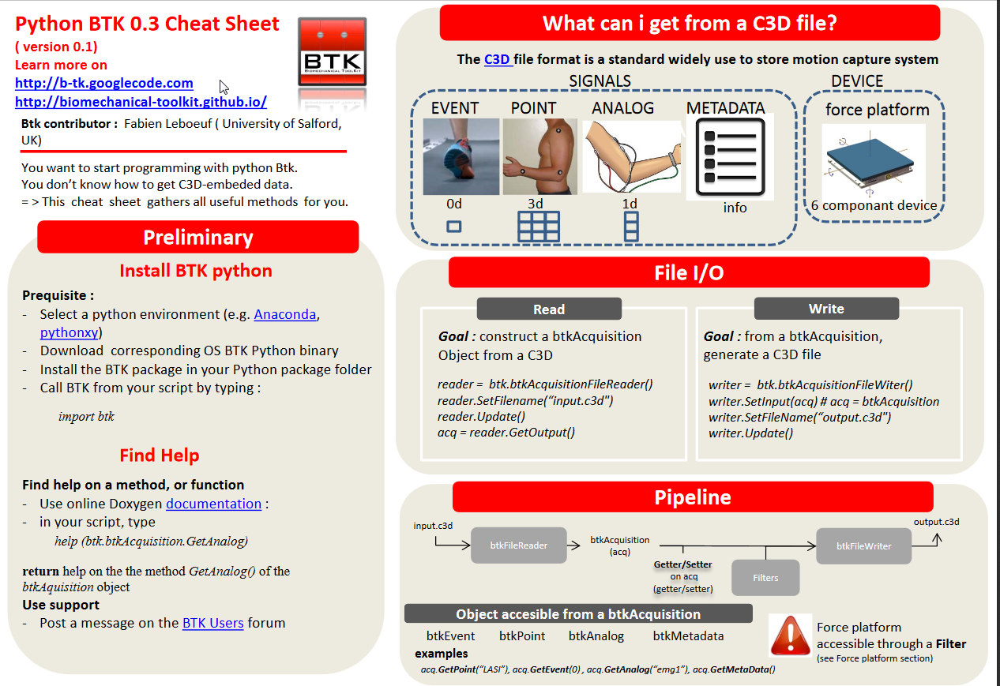

**Biomechanical ToolKit (Btk)** is an efficient cross-platform library for dealing with the c3d format especially. There are plenty of convenient methods allowing to ** read** or **write** markers, events,  or analog signals.

I gather in this cheat sheet, different snippets for helping developers to understand Btk concepts and starting coding in Python.

Check out the [Btk website](http://biomechanical-toolkit.github.io) for finding out more.


  **Btk** is no longer supported. The BTK evolved to a new project. It was heavily restructured in a new API integrated to [Moveck solutions](https://moveck.com/).       

