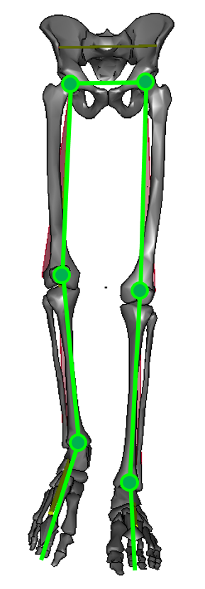

The CGM is comprised of seven segments, a single pelvis and femur, tibia and foot segments for left and right sides. These are linked in an open chain by joints with three rotational degrees of freedom (ball and socket joints). The model is sometimes described as hierarchical in the sense that the definition of each segment is dependent on the prior definition of the segment proximal to it in the chain (up to the pelvis).

An important characteristic of the CGM is that it assumes that all joints can be represented as ball and socket joints (three rotation degrees of freedom). In reality the joints, particularly the knee and ankle, are known to show translation as well as rotation. These translations are assumed to be small relative to the effects of soft tissue artefact on skin mounted markers and is generally assumed that applying such constraints improves the modelling.
