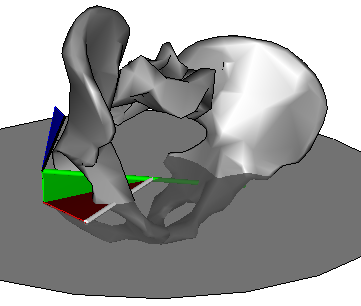
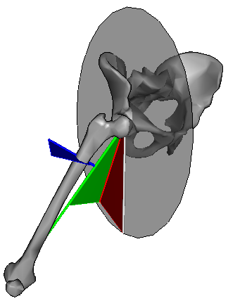
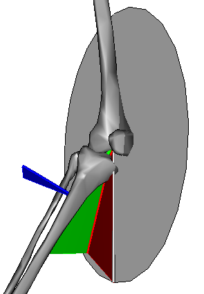
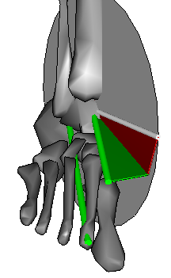

### Kinematic outputs
The primary kinematic outputs are the three dimensional joint angles representing the orientation of the distal segment with respect to the proximal segment. The CGM also outputs the three dimensional segment angles (in relation to the global axis system) for the pelvis and the transverse plane component for the foot (foot progression). All three dimensional angles are represented using Cardan angles which can generally be more easily visualised as globographic angles (Baker,[2011](http://dx.doi.org/10.1016/j.jbiomech.2011.04.031)).

As originally described the pelvic segment angles were described using the same Cardan sequence as the joint angles. Baker ([2001](http://dx.doi.org/10.1016/S0966-6362(00%2900083-7)), however,  has pointed out that this results pelvic angles that differ from the conventional clinical understanding of the angles and that reversing the Cardan sequence would rectify this (confirmed by [Foti et al., 2001](C:\Users\hls302\Dropbox\Active files\GitHub\pyCGM2io\content\reference files\Foti 2001 G&P (Pelvic angles%29.pdf)). This is the approach described in the sequence below but it should be noted that most implementations of the CGM still adopt the original approach.

#### Pelvis

(with respect to global coordinate system represented by in the figure by the horizontal disk centred on the mid-point of the hip joints).

- Internal/external rotation is the angle by which the mediolateral axis of the pelvis is rotated within the horizontal plane (red angle)
- Obliquity is the angle by which the mediolateral axis of the pelvis is raised out of the horizontal plane (green angle)      
-  Anterior/posterior pelvic tilt is the rotation about the mediolateral axis of the pelvis (blue angle).     

#### Hip

(with respect to pelvis coordinate system as represented in the figure by the disk in the sagittal plane of the pelvis and centred on the hip joint centre)

- Flexion/extension is the angle by which the long axis of the femur is rotated within the sagittal plane (red angle)
- Ab/adduction is the angle by which the long axis of the femur is rotated out of the sagittal plane (green angle)
- Internal/external rotation is that about the long axis of the femur (blue angle).     

#### Knee

(with respect to femur coordinate system as represented in the figure by the disk in the sagittal plane of the femur and centred on the knee joint centre)

- Flexion/extension is the angle by which the long axis of the Tibia is rotated within the sagittal plane (red angle)
- Ab/adduction is the angle by which the long axis of the tibia is rotated out of the sagittal plane (green angle)
- Internal/external rotation is that about the long axis of the tibia (blue angle).     

*Valgus and external rotation have been greatly exaggerated to clarify the figure.*

#### Ankle

(with respect to tibia coordinate system as represented in the figure by the disk in the sagittal plane of the tibia and centred on the ankle joint centre)

- Flexion/extension is the angle by which the long axis of the foot is rotated within the sagittal plane (red angle)
- Internal/external rotation is the angle by which the long axis of the foot is rotated out of the sagittal plane (green angle)
- Rotation about the long axis of the foot was not defined in the original CGM     

Foot progression is defined similarly to ankle rotation except that the angle is calculated relative to the global coordinate system rather than the tibia.

### Kinetic outputs

If force plate data is available then inverse dynamics can be used to calculate the moments at each joint (the net joint forces can also be calculated but have not clear clinical interpretation).

One of the differences between the Newington and Helen Hayes variants was that Newington took body segment inertial parameters from the work of [Dempster et al. 1955](https://doi.org/10.1111/j.1749-6632.1955.tb32112.x)),
whereas Helen Hayes used data from [Hinrichs et al. (1985)](http://dx.doi.org/10.1016/0021-9290(85)90016-8)
which was based on the measurements of [Clauser et al. (1969)](http://www.dtic.mil/dtic/tr/fulltext/u2/710622.pdf).

Joint moments are generally insensitive to the choice of such parameters
([Rao et al. 2006](http://dx.doi.org/10.1016/j.jbiomech.2005.04.014),
[Pearsall et al. 1999](https://doi.org/10.1016/S0966-6362(99)00011-9) )
and only minor differences would thus be anticipated in the outputs. VCM use data from Dempster et al.

Joint moments are presented as the components along orthogonal coordinate systems. Precisely which coordinate system was not specified in the original papers but the VCM defaulted to that of the distal segment (whilst giving the user an option to specify the proximal segment or the global coordinate system as alternatives).

Joint power is also calculated as the  dot product of the joint moment and joint angular velocity vectors (not that this is the true angular velocity vector and not the time derivative of the Cardan angles). Power is a scalar quantity and there is thus not biomechanical justification for presenting "components" of power.
