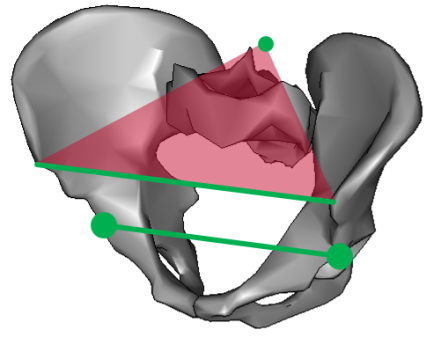
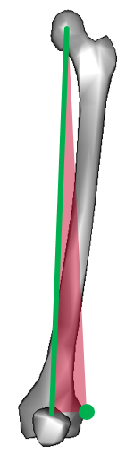
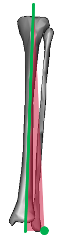
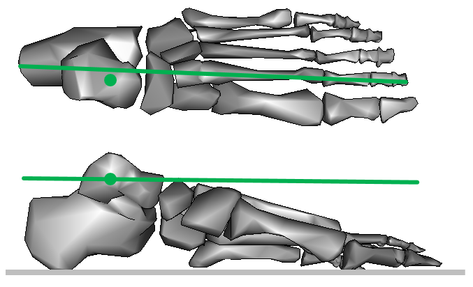

In biomechanical modelling each segment is defined by an orthogonal (right angle) coordinate system. Whilst the three axes are equivalent mathematically the model is best understood if each segment is considered to have a primary axis (running between the two joints at which it is attached to the neighbouring segments in the kinematic chain) and a secondary axis orthogonal to this and defined by a specific anatomical landmark that serves as a reference point for defining rotations about the principal axis.

Each segment is thus defined conceptually by defining its primary axis and secondary reference point. Of course a line and a segment define a triangle so each segment can be visualised by a triangle.

### Pelvis

The **primary axis** is the mediolateral axis running from one hip joint centre to the other. In most clinical applications it is assumed that the pelvis is symmetrical and that this axis is thus parallel to the line running from one anterior superior iliac spine (ASIS) to the other.

The **reference point** for rotation about this axis is the mid-point of the posterior superior iliac spines (PSIS).
The segment triangles is thus that formed by:

- the line running form one ASIS to the other and
- the mid-point of the PSISs

### Femur

The **primary axis** is that running from the hip joint centre to the knee joint centre.
The **reference point** is the lateral epicondyle.
For validation purposes:

- the hip joint centre will be taken as the geometrical centre of a sphere fitted to the articular surface of the femoral head.
- the knee joint centre will be taken as the mid-point of the medial and lateral epicondyles.  These are often difficult to palpate, however, and for some purposes the line between these landmarks will be assumed to be parallel to that linking the most posterior aspects of the femoral condyles.

### Tibia

The **primary axis** is that running from the knee joint centre to the ankle joint centre.
The **reference point** is the laterla malleolus.
For validation purposes:

- the ankle joint centre will be assumed to be the mid-point of the medial and lateral epicondyles.

### Foot

The **primary axis** is that running from the most posterior axis of the calcaneus along the second ray and parallel to the plantar surface of the foot.
Rotation about this axis is not defined.
