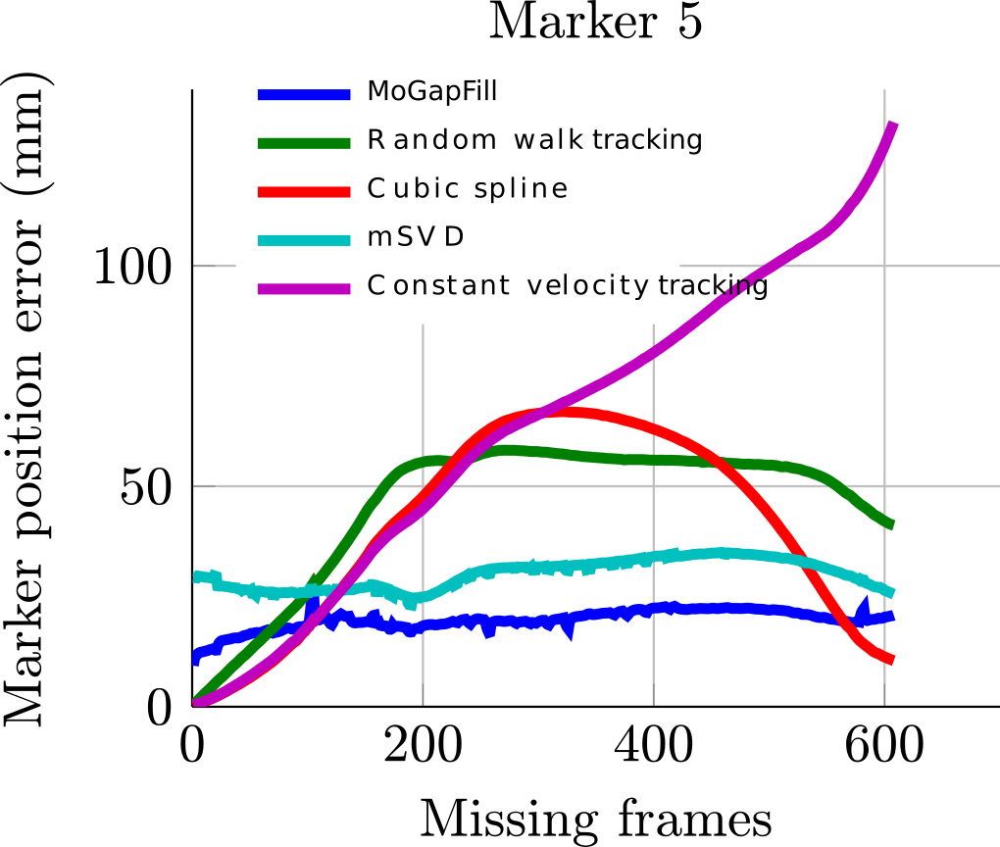

A wide range of motion capture gap filling algorithms have been developed and it can be challenging to decide which one is best for your study. This post provides a brief overview of [MoGapFill](https://www.sciencedirect.com/science/article/pii/S0021929016304766?via%3Dihub) (Burke and Lasenby 2016), and aims to provide users of this tool with some ideas around when it is best to apply it.

Missing markers are a common occurrence in studies relying on motion capture. Markers can fall off users, potentially ruining an entire experiment, or simply go missing for brief periods of time if the motions of participants obscure markers from cameras. When this happens, there are a number of options available to fix your capture sequence. These can be broadly divided into three categories:

 * Model-based methods: (eg. Aristidou and Lasenby, 2013) use knowledge of marker placement and the expected dynamics of the limbs on which markers are attached to make predictions around where missing markers may have moved.

 * Simple interpolation schemes: (eg. cubic splines) try to fill gaps by fitting a smooth polynomial or function across the gaps.

 * Learning-based approaches: try to use good data to learn about how markers are likely to move, and then use the models to predict where missing markers may have travelled.

Learning-based approaches attempt to identify appropriate gap filling algorithms by learning about the motion of markers from large quantities of example data. With the rise of machine learning, it is likely that more and more learning-based approaches to motion capture gap filling will be proposed. Users of these approaches should always try to make themselves aware of the range of data and behaviours used to train these models, as they are unlikely to be effective if used on motions that differ significantly from those used for training.

### How Mogapfill works

MoGapFill is a learning-based approach, which uses good frames (those motion capture frames where all markers are visible) in a capture sequence to identify how markers tend to move together. This knowledge is captured by trying to find a low dimensional space that is able to describe the motion of groups of markers more efficiently. Markers are then tracked in this space, and knowledge of how related markers move is used to make assumptions about the trajectories missing markers may have followed.



For example, consider four markers placed on a leg. It is likely that these markers would tend to move together in a standard gait sequence, since they are linked by a relatively rigid limb. Learning how these markers move together allows us to predict where a missing fourth marker may have moved, using the three remaining markers on the limb.

### When to use it?

In general, there is no perfect gap filling method suited for every experiment of capture process, but the following guidelines can help.

Simple interpolation schemes are best for very small or short gaps (< 1 s). More complex schemes like MoGapFill are best for longer gaps.

If you already know a lot about the motion/ participant you are recording (ie. are using a standard skeleton model, with carefully selected marker placements, and the person tracked is performing a well-studied motion) a kinematic model fit to the markers or model-based tracking approach is best.

MoGapFill is particularly useful for situations where markers are not placed carefully, or where no standard models are available. For example, in a study of animal gait, where limited skeletal models are available, a number of markers could be placed relatively haphazardly on limbs, and MoGapFill used to learn about the animal motion and use this knowledge to fill gaps. In general, MoGapFill works best when the motion studied is repetitive, or where there is sufficient opportunity (good data where the motion of markers moving together is visible) to learn about how markers move.

It is also important that the motions for which good data are available resemble the motions for which gap filling is required. For example, MoGapFill is unlikely to be effective if the only good data available is of a person approaching a chair, but gaps need to filled in a task recording participants sitting down and standing.

Unfortunately, for all interpolation and gap filling approaches, there are never any guarantees that the interpolated motion is 100 % accurate. Errors are usually highly dependent on the nature of the test sequence. Regardless of the gap filling technique used, it is still crucial that end-users visually inspect corrected trajectories to evaluate the appropriateness of these techniques for their use-cases.

### Nexus application

* run Vicon nexus
* open  *miniconda prompt*
* activate your pycgm2 virtual environment (type  `activate pycgm3`)

* [Nexus] load your c3d file
* [miniconda Console] type `Nexus_KalmanGapFilling.exe`



### References

Aristidou, A., Lasenby, J., 2013. Real-time marker prediction and cor estimation in optical motion capture. The Visual Computer 29 (1), 7–26.
