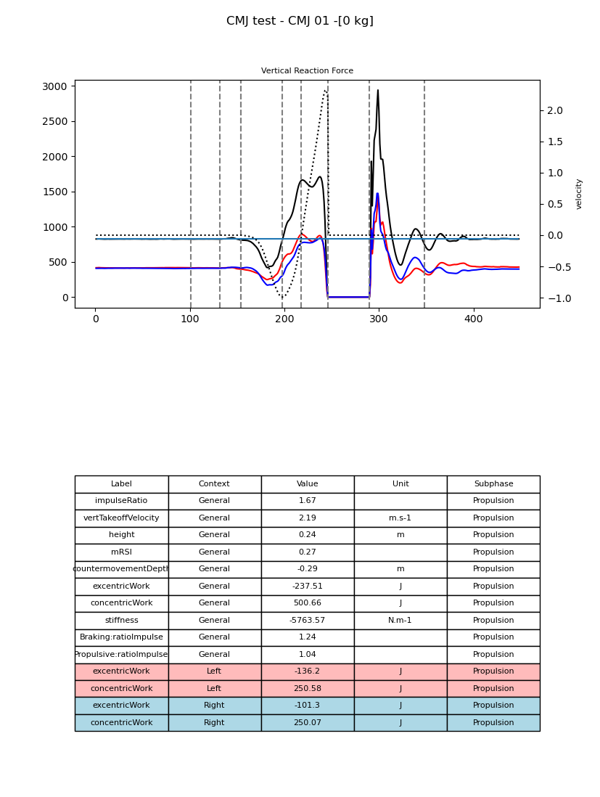

pyCGM2 plays a central role in the development of instrumented evaluation methods at the motion analysis laboratory of **the University Hospital of Nantes**, France.


  These initiatives are both private and experimental, and can be accessed upon request at fabien.leboeuf@chu-nantes.fr.


### Project: Flow

Flow represents an extension of pyCGM2, designed to optimize the gait analysis process. Through the use of a YAML format configuration file, Flow introduces a structured method for launching treatments, offering several key advantages:

 - **Traceability of Analyses:** Each configuration file records the complete history of treatments performed, facilitating the tracking and replication of analyses.
 - **Data Management:** Configurations can be easily stored and organized in databases, thus improving the efficiency of information management.

### Project: Force Plate Tests

The Force Plate Tests project focuses on the use of force platforms for the evaluation of specific movements performed on force plates :

 * standing
 * squat
 * counter movement jump
 * squat jump
 * abalakov jump
 * single leg jump
 * drop jump
 * land and hold jump
 * hop jump
 * hop and return jump

By utilizing pyCGM2, this project aims to precisely calculate various metrics characteristic of these movements, allowing a detailed analysis of performance and biomechanics of the subject.

This image is the plot panel generared for a counter Movement jump

### Project: Wheelchair Tests

In collaboration with [Maxence Gogendeau](https://www.linkedin.com/in/maxence-gogendeau-21080622a/), a student in  adapted physical activity at CHU de Nantes, the Wheelchair Tests project draws inspiration from the research of [Van der Slikke et al](https://www.researchgate.net/profile/Rienk-Van-Der-Slikke) to evaluate wheelchair movement. 

This project uses Inertial Measurement Units (IMUs) fixed on wheelchairs to collect accurate data, both in laboratory and ecological conditions. 
The goal is to provide a comprehensive and reliable evaluation of performance and efficiency of wheelchair mobility.

