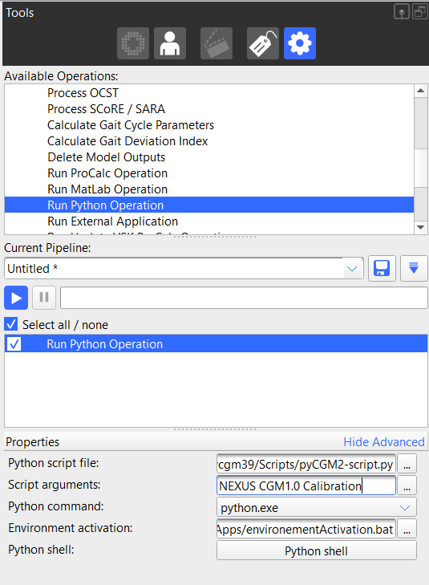

To integrate a pyCGM2 operation into a Vicon nexus pipeline, you need to insert a *run python operation* into your pipeline and configure it as follow :



 * switch to `advanced mode`
 * **the python script file** must target :  `CONDA_PATH/envs/pycgm39/Scripts/pyCGM2-script.py`
 * place the input arguments in the **script arguments** text box. 
 In this example, we want to calibrate our static trial with the CGM1.0
 * In **Environment activation**, you need to place the bat file that activate your virtual python environment -( here `pycgm39`).
   * create a new file named `environmentActivation.bat` and edit it with a text editor (e.g. notepad)
   * place into the file, the following content   
    ```bash
    @echo off
    
    rem Set the path to your Miniconda installation directory
    set "CONDA_PATH=C:\Users\fleboeuf\Miniconda3"
    
    rem Set the name of your virtual environment
    set "ENV_NAME=pycgm39"
    
    call "%CONDA_PATH%\Scripts\activate.bat" %ENV_NAME%
    ```
    * edit `CONDA_PATH`  and  the appropriate virtual environment name `ENV_NAME`
    * save your file. 

 
  if you do not know where is *CONDA_PATH*, open a conda console and type `conda info`


